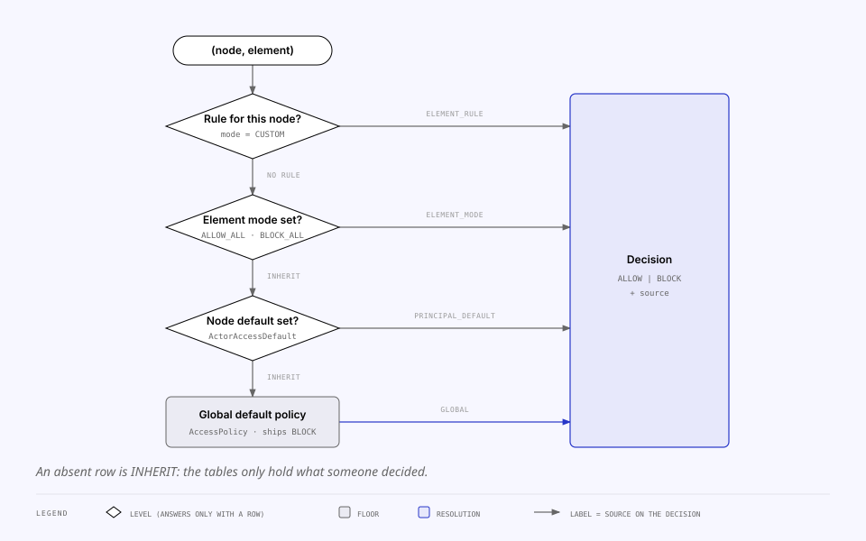
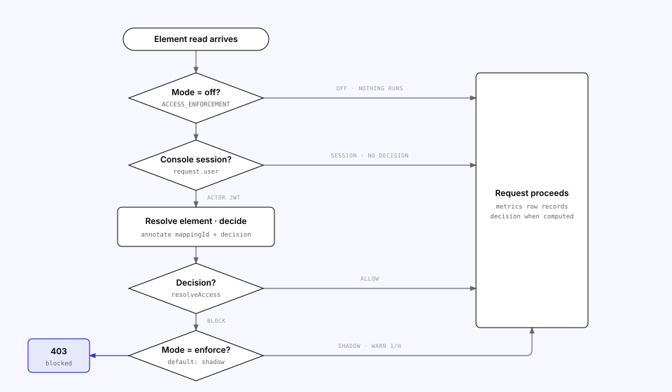

<!-- Generated from the MILS Bridge source repository (docs/features/access-control.md). Edit it there, not here. -->

# Access control

Which **node** may read which **element** — a registered mapping — through this
node's integration API. Six levels resolve to one decision through a single
shared function, and an environment flag decides whether that decision is only
recorded or actually enforced.

"Node" here means both things it can mean, because the caller is both: a MILS
`Node` is who calls, and the **actor** that owns it is the credential it calls
with ([`actors-and-nodes.md`](actors-and-nodes.md)). Rules can be written
against either.

Everything here is owned by `apps/api/src/access/`. The console surface is
`/access` (Policy · Nodes · Elements · Statistics).

## The six levels

Most specific wins. A level answers only when it has a row; otherwise the
question falls through to the next.

| #   | Level                                                                | Row                         | `source` on the decision |
| --- | -------------------------------------------------------------------- | --------------------------- | ------------------------ |
| 1   | A rule for the **calling MILS node** on this element (mode `CUSTOM`) | `ElementNodeAccessRule`     | `ELEMENT_NODE_RULE`      |
| 2   | A rule for its **owner actor** on this element (mode `CUSTOM`)       | `ElementAccessRule`         | `ELEMENT_RULE`           |
| 3   | The element's mode is `ALLOW_ALL` / `BLOCK_ALL`                      | `ElementAccess.mode`        | `ELEMENT_MODE`           |
| 4   | The **node's** own default (anything but `INHERIT`)                  | `NodeAccessDefault`         | `PRINCIPAL_NODE_DEFAULT` |
| 5   | The **actor's** own default (anything but `INHERIT`)                 | `ActorAccessDefault`        | `PRINCIPAL_DEFAULT`      |
| 6   | The global default policy                                            | `AccessPolicy` (single row) | `GLOBAL`                 |

Levels 1 and 4 are the node levels, and both are **optional**: a caller that
resolved to no node — every caller, before `MILS_INTERNAL_AUTH=node` — skips
them and gets the four-level ladder this page used to describe. A node with no
opinion of its own is governed by the actor whose key it carries, which is
"absent means inherit" one level further down. So the node levels are a no-op
until somebody writes a node rule; they exist for the case an actor owns several
peers that must not be treated alike.



**`resolveAccess` in `packages/shared/src/access-resolution.ts` is the only
implementation.** The enforcement guard (`AccessDecisionService`), the Elements
table's `allowedCount` / `blockedCount` (`ElementAccessService.list`) and the
console's "effective access" explanation all call it over the same rows, so they
cannot disagree. It ships inside the contract package precisely so a second
copy never appears.

Above all six sit the two kill switches — `ActorRegistration.enabled` and
`NodeRegistration.enabled`. Neither is part of the resolution: a disabled actor
or node is rejected outright when its token is verified, and the Elements table
counts only enabled callers. A `BLOCK` from the resolver therefore always means
a policy decision was made, not that the peer has no access at all.

### Absent means inherit

There is no row for "no opinion". A mapping with no `ElementAccess` row _is_
`INHERIT`; an actor with no `ActorAccessDefault` row _is_ `INHERIT`; a node with
no `NodeAccessDefault` row _is_ `INHERIT`, which at that level means "whatever
my owner actor gets". So:

- `GET access/elements/:mappingId` on an undecided element answers a
  synthesised `{ mode: 'INHERIT', rules: [], nodeRules: [] }`; a `404` means the
  **mapping** does not exist.
- Saving `INHERIT` **deletes** the row (both rule sets go with it by cascade).
  Saving any other mode upserts the row and replaces the rule sets wholesale —
  the console always sends the complete lists.
- `rules` and `nodeRules` are ignored unless the mode is `CUSTOM`.
- The dashboard's `elementsWithCustomRules` is `count(ElementAccess)`.

The tables only ever hold elements, actors and nodes somebody actually decided
about — which is why a deployment where each actor owns one peer never writes a
single node row.

### Defaults fail closed

`AccessPolicy.defaultPolicy` ships as `BLOCK`, matching
`ActorRegistration.enabled` defaulting to `false`. A missing policy row also
resolves to `BLOCK` (`AccessDecisionService` and `ElementAccessService` both
default it). The row is materialised on first read, so the timestamp the
console shows is stable; `updatedBy: null` marks "never chosen by anyone".

## Enforcement — `ACCESS_ENFORCEMENT`

| Value     | Behaviour                                                                                               |
| --------- | ------------------------------------------------------------------------------------------------------- |
| `off`     | No decision is computed. Nothing recorded, nothing blocked.                                             |
| `shadow`  | **Default.** The decision is computed and recorded on the request metric; every request still succeeds. |
| `enforce` | A `BLOCK` answers `403 Access to this element is blocked by policy.`                                    |



`ElementAccessGuard` (`apps/api/src/access/element-access.guard.ts`) runs
**after** `IntegrationAuthGuard`, which attaches the principal:

1. `mode = off` → pass, nothing computed.
2. A console session (`request.user`) → pass with no decision recorded: these
   rules govern nodes, and the console is how they are administered.
3. An actor (`request.actor`) → `ElementRefResolver` names the element; a route
   that is not element-scoped resolves to `null` and passes.
4. `AccessDecisionService.decide(actorId, mappingId)` → the decision is
   annotated onto the request (`annotateRequest` in
   `apps/api/src/common/request-context.ts`) so the metrics middleware records
   `mappingId` and `decision` on the `RequestMetric` row — that annotation is
   what the dashboard's `denied7d` reads.
5. `ALLOW` → pass. `BLOCK` → `403` in `enforce`; in `shadow` the request
   proceeds and a `[shadow] would block …` warning is logged at most once per
   node + element per hour, so the mode can run for weeks.

`shadow` exists because rules nothing consults are a UI with no effect, but
turning enforcement on blind would break live nodes. **Rollout:** stay on
`shadow`, watch the dashboard's denial count until the numbers are what you
expect, then set `ACCESS_ENFORCEMENT=enforce`. The Policy tab shows the current
mode (`AccessPolicyDto.enforcement`), because a rule that is recorded looks
identical to a rule that is applied.

_Access → Statistics_ does **not** show denials. It is scoped to external reads
of the unauthenticated `/rest/*` surface, where no principal is
resolved and no decision is ever made — denial numbers live on the dashboard.
`ElementRefGuard` runs on the item reads there, but only to record _which_
element was read: it never decides, and it is deliberately independent of
`ACCESS_ENFORCEMENT`, so switching enforcement off does not empty that page
([`mils-internal-api.md`](mils-internal-api.md)).

**Lists are filtered under `enforce` only**, and that is the same rule stated
from the other side: filtering a list _is_ enforcement, so a `shadow`
deployment that quietly shortened one would be enforcing while its Policy tab
reported that it does not. Three reads apply it, all through
`AccessDecisionService.visibleTo` — the batched counterpart of `decide`, same
function over the same rows, so a list and a per-element read cannot disagree:
`GET /api/integration/mappings`, `GET /api/integration/item-payloads`, and
`GET /rest/MilsItems` (whose guard therefore takes the credential but no
element decision — a list is about many elements and the guards are shaped for
one).

### Where it applies

| Method | Path                                             | Guard                       | Which element                                            |
| ------ | ------------------------------------------------ | --------------------------- | -------------------------------------------------------- |
| `GET`  | `/api/integration/mappings/:id`                  | session or actor + element  | That mapping                                             |
| `GET`  | `/api/integration/mappings/lookup?…`             | session or actor + element  | Whatever the lookup resolves to                          |
| `GET`  | `/api/integration/item-payloads/:milsId`         | session or actor + element  | The mapping with that MILS id                            |
| `GET`  | `/api/integration/files/:milsId` and `…/content` | session or actor + element  | Via `StoredFile.mappingId`                               |
| `GET`  | `/rest/MilsItems`                                | in the handler, not a guard | Every element under the object, batched (`enforce` only) |

`ElementRefResolver` (`apps/api/src/access/element-ref.resolver.ts`) is a
table keyed by the **matched route pattern**, so adding a route to enforcement
means adding a line there. Its MILS-id lookup tolerates bracing and case
(`ResourceMapping.milsId` holds the braced GUID as MILS returned it; path
params carry the bare id).

### What is not enforced

- **Console sessions** — see step 2 above.
- **List routes** (`GET mappings`, `GET item-payloads`, `GET files`): they
  return references, not payloads, and are not filtered per node.
- **Writes** — archive/reactivate and registration are not element-read
  decisions. Nor is the inbound object-access write, which is _answered_ by a
  decision rather than refused by one (above).
- **Outbound peer reads** (`/api/integration/peer/*`) — the access model decides
  what _others_ may read from us; what we may read from a peer is the peer's
  decision, taken through its own handshake. See
  [`actors-and-nodes.md`](actors-and-nodes.md) § Which switches gate an outbound
  read.
- **`/rest/*`** — unauthenticated by default, so there is no
  identity to decide on. `MILS_INTERNAL_AUTH=actor` or `node` brings that
  surface under the same guard and the same rules; see
  [`mils-internal-api.md`](mils-internal-api.md).
- **The two upstream proxies** (`/api/mils/*`, `/api/concore/*`) — verbatim
  pass-throughs, not element-scoped, and unguarded, so their request metrics
  carry `principalType = none` even for console traffic.

## The same resolver also answers inbound access requests

`resolveAccess` is no longer read only when serving an element. Since federated
reads, the inbound `POST /rest/MilsObjectAccesses` — the BLM
contract's permission handshake — publishes an `ObjectAccessState` derived from
the very same six levels:

```
POST /MilsObjectAccesses { ObjectId }        ← a MILS Object, never an item
  → the ROOT of that object's tree (ResourceMapping.milsRootObjectId)
  → every element under that root, may be none
  → resolveAccess(policy, principal, element) for each
  → any ALLOW → state 1 · otherwise → state 2 · no principal → state 0 (pending)
```

**The unit is an object, and this node enforces per element**, so the two
granularities meet in one place: `objectAccessStateForSet`. The rule is
**any-allows** — the object is granted when the caller may read at least one
element under it.

### The unit is the root of the object tree — and it is site-sized

The network registers permission at the **root** object: a site, not a room, and
one record covers what hangs beneath it. So an ask about a building is answered,
stored and echoed as an ask about the root that building belongs to, and the
any-allows fold runs over **every element in that root's subtree**.

Read that twice, because it is wider than folding one object was: **one allowed
element anywhere under a root grants the root.** Allowing a node on a single
element in _Access → Elements_ therefore answers "yes" to a handshake about the
whole site. It stays defensible for the reason the fold was any-allows to begin
with — `ElementAccessGuard` still decides every individual read, so a granted
root answers `403` on the items the caller may not have under
`ACCESS_ENFORCEMENT=enforce` — and it is the shape the network asked for. But if
you want a node kept away from a site entirely, the thing to check is that it
has no ALLOW on **any** element under it, not just on the ones you were
thinking of.

Two properties keep this honest:

- **The enumeration does not widen with the grant.** `GET /rest/MilsItems`
  answers for exactly the `ObjectId` asked for and never expands to the
  subtree, so a peer granted a root still has to ask about each object it wants
  listed. Permission is broad; disclosure stays per-object.
- **The root is read from this node's own rows, never resolved on demand.** The
  tree is walked (`mils/object-tree.ts`) at registration and by
  `backfill:mils-root-objects`, and stored per element. An unauthenticated
  handshake therefore makes no upstream call and cannot be used to make this
  node call MILS. Where no root is known — an un-backfilled row, or an
  intermediate object this node holds nothing under — the object asked about is
  treated as its own root, which is narrower than the truth and never wider.

"All must allow" reads simpler and behaves worse: one blocked element would hide
a whole building, and a grant would decay silently every time somebody
registered an unrelated element under the same object. Any-allows says the
honest thing instead — _there is something here for you_ — and which things is
still decided element by element on the read, because `ElementAccessGuard` is
untouched. **So a granted object can still answer `403` on one of its items**,
and that is correct: the grant is a gate, not a bypass.

So **where an operator changes a grant is where they already change access**:
_Access → Elements_, per node. That is the point of deriving it — a separate
grant screen would be a second access model competing with this one.

Two differences from an element read, both deliberate:

- **`ACCESS_ENFORCEMENT` does not gate it.** That switch decides whether we act
  on a decision when _serving_; here we are publishing one. A node running
  `shadow` that answered `0` to every request would be silently unreadable for a
  reason no operator could find. The consequence is a real asymmetry: a `shadow`
  deployment can grant a request and then serve a payload it would otherwise have
  blocked, because the item reads stay governed by `ACCESS_ENFORCEMENT` as
  before.
- **An object with no elements is not special-cased.** An access request names
  an arbitrary MILS object this node may hold no mapping for, and the ladder
  already falls through to the principal's default and then the global policy —
  whose own default is `BLOCK`.

`MilsObjectAccess.mappingId` records which element the answer came from — the
one that said ALLOW, or the last that said BLOCK — so "why was I refused" opens
a row rather than showing only a number.

The mapping lives in `apps/api/src/mils-internal/object-access-decision.ts`;
the full write-up is in
[`mils-internal-api.md`](mils-internal-api.md) § The other direction.

## Who may change the rules

The whole `/api/integration/access/*` surface is a **console** surface: guarded
by the session cookie (`AuthGuard`), never the actor JWT, and absent from
`PUBLIC_INTEGRATION_PREFIXES`. A node cannot read — let alone change — the rules
that govern it.

| Method  | Path                                          | Guard             | Purpose                                                                                                  |
| ------- | --------------------------------------------- | ----------------- | -------------------------------------------------------------------------------------------------------- |
| `GET`   | `/api/integration/access/policy`              | session           | The global default + the enforcement mode                                                                |
| `PUT`   | `/api/integration/access/policy`              | session + `ADMIN` | Set the global default                                                                                   |
| `GET`   | `/api/integration/access/principals`          | session           | Nodes: the actor registry joined with defaults and per-node rule counts                                  |
| `PATCH` | `/api/integration/access/principals/:actorId` | session + `ADMIN` | Set an actor default (`INHERIT` deletes the row); `404` for an actor not in the registry                 |
| `GET`   | `/api/integration/access/nodes`               | session           | The MILS nodes, with their own defaults and per-node rule counts                                         |
| `PATCH` | `/api/integration/access/nodes/:nodeId`       | session + `ADMIN` | Set a node default (`INHERIT` deletes the row — back to its owner actor); `404` for an unknown node      |
| `GET`   | `/api/integration/access/elements`            | session           | The Elements table (registered mappings + resolved counts); unpaged, capped at 500 with `X-Truncated: 1` |
| `GET`   | `/api/integration/access/elements/:mappingId` | session           | One element's mode and rules (synthesised `INHERIT` when no row)                                         |
| `PUT`   | `/api/integration/access/elements/:mappingId` | session + `ADMIN` | Save mode + rules; unknown actor ids → `400`                                                             |

Writes require `ADMIN` through `RolesGuard`; the console disables the controls
for members (`apps/web/src/features/access/use-can-edit.ts`), but that is UX —
the guard is the boundary. A `403` surfaces as "Ask an administrator to make
this change."

Every write records an `AuditEvent` with `kind: 'ACCESS'` (`SET_POLICY`,
`SET_PRINCIPAL_DEFAULT`, `SET_NODE_DEFAULT`, `SAVE_ELEMENT_ACCESS`), a
plain-sentence summary and a
link back to the page it happened on — what the activity feed and
`GET /api/integration/audit` show.

## Which principal a decision is taken on

**Both**, most specific first. `AccessDecisionService.decide(actorId, mappingId,
nodeId?)` loads the actor's default, the node's default when the caller resolved
to one, and both of the element's rule sets, then hands all of it to
`resolveAccess`.

What that buys is the thing an actor-only model cannot express: two peers
sharing one credential, treated differently. What it costs is one extra indexed
lookup per decision, and only when a node was resolved.

`nodeId` reaches the decision from `request.node`, which the token verifier
attaches when the token names a peer ([`actors-and-nodes.md`](actors-and-nodes.md)).
A caller with no node — anything authenticating as a bare actor — resolves
exactly as it always did.

### Counts are counts of callers

`allowedCount` / `blockedCount` on the Elements table, and the dashboard card's
"nodes", count **callers**: every enabled MILS node, plus every enabled actor
that owns none. An actor with three peers is three callers, because three peers
can read; counting credentials would put a different denominator on two cards
that answer the same question.

## Actor ids

`ActorRegistration.actorId` is the canonical form: the MILS ActorId
**unbraced**, in whatever case MILS returned (the registry does not lowercase
it). `ActorAccessDefault.actorId` is a foreign key to it and
`ElementAccessRule.actorId` is matched against it, so both store that exact
value.

An incoming id is canonicalised **through the registry**
(`apps/api/src/access/actor-id.ts`: `unbrace`, `actorKey`,
`canonicalActorIds`), never by lowercasing — a braced or differently-cased id
resolves to the stored value, and an id the registry does not know is rejected
(`400` for a rule, `404` for a node default) rather than stored where it could
never match. `resolveAccess` also folds case when matching, as a second line of
defence.

`NodeRegistration.nodeId` and the ids in `NodeAccessDefault` /
`ElementNodeAccessRule` work identically, against the node registry, and reuse
the same `actorKey()` helper — it is only "unbrace and case-fold", and node ids
arrive from MILS with the same bracing convention.

## Data model

| Model                   | Purpose                         | Owner module | Uniqueness / FK / cascade                                                                                                       | Pruning |
| ----------------------- | ------------------------------- | ------------ | ------------------------------------------------------------------------------------------------------------------------------- | ------- |
| `AccessPolicy`          | The global default              | `access/`    | Single row `id = "singleton"`; `defaultPolicy` defaults to `BLOCK`                                                              | —       |
| `ActorAccessDefault`    | Per-node default                | `access/`    | PK `actorId` = FK → `ActorRegistration.actorId`, cascade; absent row = `INHERIT`                                                | —       |
| `ElementAccess`         | Per-element mode                | `access/`    | PK `mappingId` = FK → `ResourceMapping.id`, cascade; absent row = `INHERIT`                                                     | —       |
| `ElementAccessRule`     | Per-element, per-actor decision | `access/`    | `@@unique([mappingId, actorId])`, FK → `ElementAccess`, cascade; `actorId` has **no FK** (writes validate against the registry) | —       |
| `NodeAccessDefault`     | Per-MILS-node default           | `access/`    | PK `nodeId` = FK → `NodeRegistration.nodeId`, cascade; absent row = `INHERIT` (= its owner actor)                               | —       |
| `ElementNodeAccessRule` | Per-element, per-node decision  | `access/`    | `@@unique([mappingId, nodeId])`, FK → `ElementAccess`, cascade; `nodeId` has **no FK**, like `actorId`                          | —       |

The two rule tables are separate rather than one table with a nullable
`nodeId`: SQLite treats NULLs as distinct in a unique index, so "one rule per
element per principal" would silently stop being enforceable the moment that
column went nullable.

Nothing is added to `IntegrationSettings`, `ActorRegistration` or
`NodeRegistration`, on purpose: both syncs upsert registry rows without ever
touching an access default (the same fail-closed reasoning they apply to
`enabled`), and deleting a mapping takes its access rows by cascade.

`access/` reads `ResourceMapping`, `ActorRegistration` and `NodeRegistration`
through Prisma directly rather than importing their modules, so none of them has
to know access control exists.

## Related

- [`actors-and-nodes.md`](actors-and-nodes.md) — the registry, `enabled`, and actor tokens.
- [`mils-internal-api.md`](mils-internal-api.md) — the surface that is attributed but never enforced.
- [`configuration.md`](configuration.md) — `ACCESS_ENFORCEMENT`.
  `ui-v2-dashboard-and-access-plan.md`.
