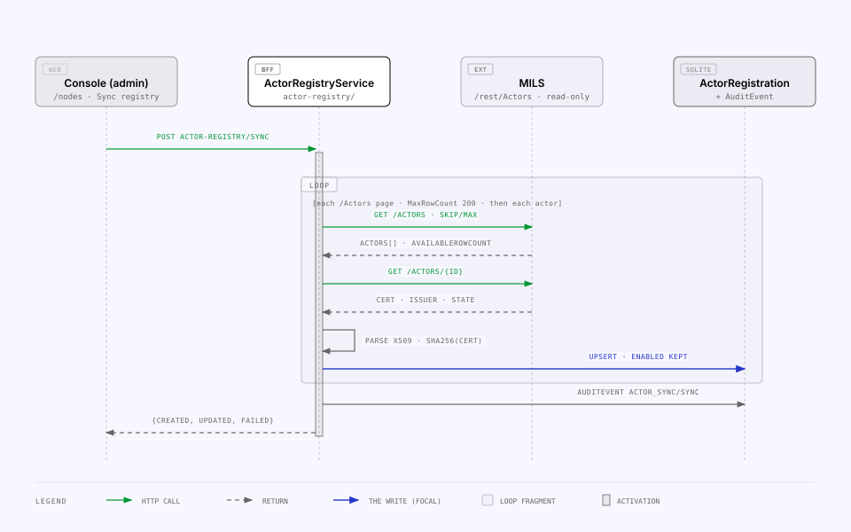
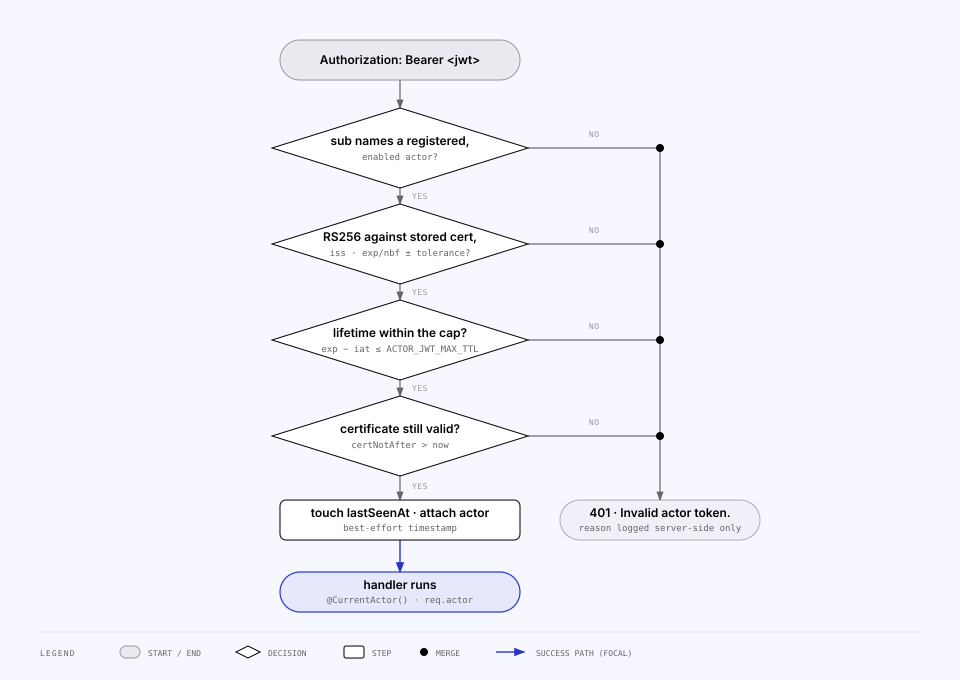

<!-- Generated from the MILS Bridge source repository (docs/features/actors-and-nodes.md). Edit it there, not here. -->

# Actors and nodes

The BFF keeps a registry of MILS actors — the external systems that may fetch registered data through it — and verifies their JWTs against the certificate MILS publishes for each one. This page covers the registry, its sync from MILS, the per-actor kill switch and the token verification; which data those actors may then read is [access control](access-control.md).

## Which "node" this page means

Both of them, now — which is why the page shows the relationship rather than picking a winner.

The glossary's [_Node_](glossary.md#who-calls-the-bff) has three meanings. The console has always used meaning (3): on the Access pages an **actor** is called a **node**, because that is how an operator thinks of a system that connects to the bridge. Since the node registry landed, meaning (2) — the MILS `Node` entity — is cached here too, because **a node is not a credential**: MILS publishes the token issuer and certificate per _actor_, and a node names its _owner actor_. So the two are nested on screen: an actor holds the key, and the MILS nodes under it are the peers that key can speak for (usually exactly one).

| Where                          | Word  | Refers to                                                                              |
| ------------------------------ | ----- | -------------------------------------------------------------------------------------- |
| `packages/shared`, `apps/api`  | actor | A MILS `Actor` and its `ActorRegistration` row — the credential                        |
| `packages/shared`, `apps/api`  | node  | A MILS `Node` and its `NodeRegistration` row — the caller                              |
| _Access → Nodes_ (parent rows) | node  | The actor (`consumers` in `DashboardOverviewDto.access`)                               |
| _Access → Nodes_ (nested rows) | node  | The MILS nodes that actor owns                                                         |
| `/nodes`, `/actors`            | —     | MILS reference lists proxied verbatim; `/actors/$actorId` adds the panel               |
| Audit summaries                | node  | `"Synced nodes from MILS — …"` (actors), `"Synced MILS nodes — …"` (the node registry) |

## What the registry holds

One `ActorRegistration` row per MILS actor (`apps/api/prisma/schema.prisma`). The row is a **cache of public material** plus one BFF-owned flag; the BFF never holds an actor's private key and never issues actor tokens.

| Column            | From MILS field            | Used for                                                            |
| ----------------- | -------------------------- | ------------------------------------------------------------------- |
| `actorId`         | `ActorId`, braces stripped | Unique key; must equal the JWT `sub`                                |
| `actorCode`       | `ActorCode`                | Display, sort order                                                 |
| `actorName`       | `ActorName`                | Display                                                             |
| `contactEmail`    | `ActorContactEMailAddress` | Display                                                             |
| `tokenIssuer`     | `ActorTokenIssuer`         | Enforced as the JWT `iss`                                           |
| `certificatePem`  | `ActorCertificate`         | Public X.509; its public key verifies the token signature           |
| `certFingerprint` | derived                    | `sha256(DER)` hex — short identity, integrity check across re-syncs |
| `certNotAfter`    | derived                    | Expiry check on every token; "expiring soon" on the dashboard       |
| `actorState`      | `ActorState`               | Mirror of the MILS state                                            |
| `enabled`         | —                          | **The kill switch.** Defaults to `false`; only an admin flips it    |
| `lastSyncedAt`    | —                          | Set on every sync                                                   |
| `lastSeenAt`      | —                          | Last successful actor-API authentication                            |

`ActorAccessDefault` (the per-node access default) hangs off this row but is owned by `apps/api/src/access/` — the sync never reads or writes it.

## Syncing from MILS

MILS exposes actors read-only, and `GET /Actors` omits the certificate and issuer, so a sync pages the list and then fetches every actor's detail.



What `ActorRegistryService.syncFromMils()` (`apps/api/src/actor-registry/actor-registry.service.ts`) guarantees:

| Rule                         | Detail                                                                                                        |
| ---------------------------- | ------------------------------------------------------------------------------------------------------------- |
| One read per actor state     | MILS answers `400 Query.Filter` to an unfiltered `/Actors` — every filter is optional in the spec and mandatory in practice — so "every actor" is the **union of one paged read per `ACTOR_STATE_SWEEP` value** (`[0, 1]`, measured: `2` is outside the attribute's value set), ids deduplicated across the sweep. A state MILS refuses is warned about and skipped; every state refusing is a `502`. An actor published in a state outside the sweep would be invisible — the runbook says how to spot that |
| Pages of 200                 | `SkipRowCount` / `MaxRowCount`; accepts the `{ AvailableRowCount, Actors }` envelope and the older bare array |
| Detail per actor             | `GET /Actors/{id}`; a non-200 detail counts the actor as `failed`                                             |
| Unusable actors are skipped  | Missing id, certificate or issuer, or a PEM that `X509Certificate` cannot parse → `failed`, no row written    |
| `enabled` survives a re-sync | The upsert's `update` branch omits `enabled`; only `create` sets it, to `false` (fail closed)                 |
| Every sync leaves a trail    | `AuditEvent` kind `ACTOR_SYNC`, action `SYNC`, details `{ created, updated, failed }`, linking to `/access`   |
| Upstream failure is a `502`  | A non-2xx from the list read throws `BadGatewayException`                                                     |
| Result                       | `SyncActorRegistryResultDto` — `synced` (= created + updated), `created`, `updated`, `failed`                 |

Three ways to run it:

| Trigger                                                                                     | Who             | Notes                                                                                |
| ------------------------------------------------------------------------------------------- | --------------- | ------------------------------------------------------------------------------------ |
| `POST /api/integration/actor-registry/sync`                                                 | console `ADMIN` | Records the admin's email on the audit row                                           |
| **Sync registry** button on `/nodes` (`apps/web/src/features/nodes/node-registry-sync.tsx`) | console `ADMIN` | Same call; the empty state on _Access → Nodes_ links there                           |
| `pnpm --filter @bridge/api sync:actor-registry`                                             | operator        | `apps/api/scripts/sync-actor-registry.ts`; exits `1` when `failed > 0`; no `byEmail` |

There is no scheduler: the registry is as fresh as the last sync, by design (see [`runbooks.md`](runbooks.md)).

## The kill switch

`PATCH /api/integration/actor-registry/:actorId` with `{ enabled }` is the master switch that outranks every access rule: a disabled actor cannot authenticate at all, whatever _Access_ says. It writes an `ACTOR_SYNC` audit event with action `ENABLE_ACTOR` / `DISABLE_ACTOR` and the actor's code. In the console it is the **API access** panel on an actor's detail page (`apps/web/src/features/actors/actor-api-access.tsx`, admins only, confirm dialog on disable) and the toggle on _Access → Nodes_.

## The node registry

`NodeRegistration` (`apps/api/src/node-registry/`) caches MILS `/Nodes` so an inbound token can be resolved to the **peer that sent it**, not merely to an actor.

| Column                       | From MILS field                    | Used for                                                                                               |
| ---------------------------- | ---------------------------------- | ------------------------------------------------------------------------------------------------------ |
| `nodeId`                     | `NodeId`, braces stripped          | Unique key; what a token's node claim names                                                            |
| `nodeName`, `nodeHostName`   | `NodeName`, `NodeHostName`         | Display, plus the derived `milsInternalUrl` (below). **The host name is never an authorization input** |
| `nodeType`, `nodeState`      | `NodeType`, `NodeState`            | Mirrors of the MILS enums                                                                              |
| `ownerActorId`               | `NodeOwnerActorId` (list read)     | **The link to the credential**: which actor's certificate verifies its tokens                          |
| `ownerActorCode`             | `NodeOwnerActorCode` (detail read) | Display; also lets a token name its actor by code                                                      |
| `ownerActorName`             | `NodeOwnerActorName` (list read)   | Display                                                                                                |
| `enabled`                    | —                                  | **The per-peer kill switch.** Defaults to `false`; only an admin flips it                              |
| `lastSyncedAt`, `lastSeenAt` | —                                  | As on the actor row                                                                                    |

Three decisions worth knowing:

- **No foreign key to `ActorRegistration`.** The actor sync skips any actor without a usable certificate, so an FK would make exactly those nodes unstorable — and "this peer can never authenticate here" is what an operator most needs to see. The DTO's `linked` is computed per read (a persisted flag would go stale the moment an actor sync ran) and the console gives unlinked nodes their own card.
- **The link comes from the list read.** `NodeOwnerActorId` is in `GET /Nodes` itself, so `GET /Nodes/{id}` is best-effort: it is read only for `NodeOwnerActorCode`, which the list omits, and a failure leaves the code `null` rather than dropping the node. Contrast the actor sync, where the detail read carries the certificate and a failure makes the actor unusable.
- **`NodeState` is mirrored, not enforced.** `mils.yaml` types it as an `int64` and enumerates nothing — exactly like `ActorState`, which the actor registry has always mirrored without gating on it. Gating on a value whose meaning we would be guessing locks peers out for reasons nobody can explain.

**Where a peer is.** Every MILS node has a host name, and the network's convention is that its node-to-node API answers at its REST root, `<NodeHostName>/rest` — e.g. `https://blockmaterials.dynabloqs.dev/rest/MilsObjectAccesses`. `peerMilsInternalUrl()` (`node-registry/peer-endpoint.ts`, pure and tested) derives it per read into `NodeRegistrationDto.milsInternalUrl` — never stored, because a re-sync would leave it pointing at the old host. A bare host gets `https`, an explicit `http` is preserved rather than upgraded, a port survives, an IPv6 literal stays bracketed, and a host name that already carries a path is **refused** rather than concatenated: a wrong URL that looks plausible is worse than none.

That convention is symmetric, so peers compute _our_ URL the same way — which is why **this BFF serves `mils-internal` at that exact path**, outside its own global `api` prefix, instead of keeping an `/api`-prefixed address and a rewrite ([`mils-internal-api.md`](mils-internal-api.md)). The host name's "never authorization" rule stays true and becomes load-bearing: it selects where we _send_ a request, never who a caller _is_ — nothing on the inbound path reads it.

_Access → Nodes_ shows the URL under each node and, for an admin, a **Test connection** button (`PeerProbeService`): it mints a token for **that peer's** audience (`peerAudience(row)` — the audience names the recipient: the row's stored override, else `<owner actor code>-mils-api`) and reads `GET /MilsObjectAccesses/<an id that cannot exist>`, so nothing is written on either side and no data moves. A JSON `404` is the success condition — reaching the handler proves more than a `200` on a guessed URL would; `401`/`403` reads as "the peer refused us, possibly for a different audience", and a non-JSON `404` as "something answered on that host, but not this API" — and since the probe goes through the same `PeerHttpService` as the federated read, the sentence says **what** answered (a bridge's error envelope, a reverse proxy by its `server` header or a Basic challenge, an HTML page) and the result opens to the exchange behind it: the request line, our token's decoded claims, the redacted headers, the DNS answer, the TCP endpoint, the TLS certificate presented, per-phase timings, the response headers and the first bytes of the body, plus the body we sent when there was one and a **cURL** that reproduces the request — the bearer a `$MILS_PEER_TOKEN` placeholder, since the trace never holds the token; an ADMIN can instead copy it with a token freshly minted for that peer through the hand-off route. The target always comes from the registry and never from the request, which is what keeps it from being an SSRF surface.

### Seeing the network

Every outbound call to a peer — the probe, both handshake legs, both payload reads, the loopback — goes through one request shape, `peer-transport/peer-http.service.ts`: the target guard, the configured timeout, `maxRedirects: 0`, `validateStatus: () => true`, an observed socket (addresses, remote endpoint, TLS certificate, per-phase timings), one `HTTP:Peer` log line tagged with a per-click **trace id**, and a redacted **`PeerExchange`** row written after the caller has classified the result — so the stored outcome and message are the words the console showed. The row keeps both directions: the request headers and the serialised body we sent (capped at `PEER_TRACE_BODY_MAX_BYTES`, like the answer's excerpt; `null` on rows from before 2026-09-03), and the response headers and body excerpt. Two pure classifiers feed the sentences: `classifyTransport` names the phase a call died in (`DNS`, `CONNECT`, `TLS`, `TIMEOUT`, `RESET`, `REDIRECT`, `PROTOCOL`) with a fix, and `fingerprintResponder` tells a bridge from a MILS-internal API, a reverse proxy and an HTML page. The plan and its deviations: `peer-network-observability-plan.md`.

The inbound half is **`PeerAuthEvent`**: every refused peer token, recorded by `PeerAuthLogService` with the request around it (route pattern, remote address, `X-MILS-Node-Id`, the token's digest and decoded claims, how far the ladder got, the reason) — the facts the uniform 401 hides from the caller, kept on our side. Identical rejections within a minute collapse into one row. The verifier throws a `TokenRejection` carrying the reason; the guards hand it to the log; the response body is unchanged.

On _Access → Nodes_:

- **This node** (top of the tab): the posture the API logs at boot, the claims we stamp, and the **self-check** (`SelfCheckService`, `GET …/node-registry/self`) — would a peer that synced MILS accept a token from us? It looks our own actor code up in the actor registry, compares our signing key's SPKI with the published certificate's, our `iss`/`sub`/`aud` with the published issuer and code, runs a fresh token through the very `verifyAgainstActor()` a peer runs, checks the certificate's expiry and our own node row. Twelve findings, each naming both sides of a mismatch; **no outbound call**. ADMINs can **Probe ourselves** (the loopback: our own derived URL, exactly as a peer would call it — proving the proxy forwards `/rest` from the public host name) and **Hand over a token** (a ≤ 15-minute token for a peer's operator to paste into _their_ inspector; shown once, audited by digest, `PEER_TOKEN_EXPORT=off` removes it).
- **Each node row**: the last refused token beside _last seen_ (derived per read from the rejection log), the probe result with its exchange, and a **Diagnostics** toggle: _What we sent_ (the exchange trace for that peer), _What they sent_ (accepted requests from `RequestMetric`, refused tokens with a **Re-run the ladder** button that runs the inspector on the stored claims), and _Access requests received_ (the `MilsObjectAccess` rows their handshake created, joined to the element).
- **Refused tokens from unknown callers** (ADMIN): rejections the ladder could not pin to a node.

On the item page, the peer panel's **What happened** lists every exchange about the item, grouped per action, each opening to the same exchange view — body sent, cURL included (`peer-exchange-request-body-curl-plan.md`). From a shell, `peer:diagnose`, `peer:self-check` and `inspect:token` ([`runbooks.md`](runbooks.md)) call the same services.

Sync (`NodeRegistryService.syncFromMils()`) mirrors the actor sync: pages of 200, both list envelopes tolerated, `enabled` preserved on update, one `ACTOR_SYNC` audit row (action `SYNC_NODES`), `502` on an upstream failure. A node with no `NodeId` or no `NodeOwnerActorId` counts as `failed` and is not written — neither can ever resolve to a credential. **Actors are synced first**: the one _Sync registry_ action runs both halves in that order, because pulling nodes first would report every node as unlinked on a first run.

| Method  | Path                                                  | Guard            | Purpose                                                                                                      |
| ------- | ----------------------------------------------------- | ---------------- | ------------------------------------------------------------------------------------------------------------ |
| `GET`   | `/api/integration/node-registry`                      | session          | List registrations (`NodeRegistrationDto[]`)                                                                 |
| `POST`  | `/api/integration/node-registry/sync`                 | session, `ADMIN` | Sync the node half alone                                                                                     |
| `POST`  | `/api/integration/node-registry/inspect-token`        | session, `ADMIN` | What this node would do with a peer's token, and why                                                         |
| `POST`  | `/api/integration/node-registry/:nodeId/test`         | session, `ADMIN` | Probe that peer: address it with _its_ audience and read an absent object access over its derived URL        |
| `GET`   | `/api/integration/node-registry/:nodeId/exchanges`    | session          | What we sent to that peer and what came back — the newest exchanges, redacted, grouped per action            |
| `GET`   | `/api/integration/node-registry/:nodeId/inbound`      | session          | What that peer sent us: accepted requests, refused tokens, the access requests it filed                      |
| `GET`   | `/api/integration/node-registry/inbound/unattributed` | session, `ADMIN` | Refused tokens the ladder could not pin to any node                                                          |
| `GET`   | `/api/integration/node-registry/self`                 | session          | The self-check: posture, our actor row, the claims we stamp, twelve findings. **No outbound call**           |
| `POST`  | `/api/integration/node-registry/self/probe`           | session, `ADMIN` | The loopback: probe our **own** derived URL exactly as a peer would                                          |
| `POST`  | `/api/integration/node-registry/self/token`           | session, `ADMIN` | Mint a ≤ 15-minute token for a peer's operator to inspect; audited; `PEER_TOKEN_EXPORT=off` removes it (404) |
| `PATCH` | `/api/integration/node-registry/:nodeId`              | session, `ADMIN` | `{ enabled: boolean }` — the per-peer kill switch                                                            |

The read needs only a session (it feeds _Access → Nodes_, which members can see, and returns public MILS material plus this node's own flags); every write needs `ADMIN`, matching `AccessController` rather than the actor registry.

## Federated reads: this node as a caller

Phases 1–5 of the identity work made this node a correct **callee** and proved,
from an ADMIN button, that a peer can be reached. Federated reads build the
caller: resolving a **peer-owned** MILS item through the network.

The one thing federation is: **MILS is the index, the owning node holds the
payload, and the owning node decides whether we get it.**

```
MILS says item X belongs to object O, and node N owns X
  → N's host name → https://<host>/rest
  → aud = the recipient's, signed with our key
  → POST /MilsObjectAccesses  { "ObjectId": "{O}" }         ← ask about the OBJECT
      201 { ObjectId: <handle>, ObjectAccessState }         ← …and the answer, if it gives one
  → GET  /MilsObjectAccesses/<handle> → ObjectAccessState   ← only when it did not
  → GET  /MilsItems/<X>/ItemData                            ← read the ITEM
```

**The state read is a fallback and a re-check, not a step.** A peer that
decides synchronously can answer the decision on its own `201` — this node does
— and then the handshake is one call rather than two; `PeerAccessService` reads
it when it is there and only falls back to the GET when the peer answered a
handle alone. `null` there is kept strictly apart from `0`: no state means "we
were told nothing, go and read it", where `0` is a peer's own "pending".

The GET remains what _Check again_ calls — it re-reads whatever the peer has on
file. Note what that does and does not do against a peer implementing this
surface the way this node does: the answer comes from the peer's **stored** row,
so a decision its operator has since changed surfaces on _Ask again_ (`?again=1`,
a fresh POST, which makes that peer re-decide) rather than on a re-check.

That `<handle>` is whatever the peer's `201` gave — an access record's own id,
or (as this node now answers) the object id itself. The contract names its `201`
field and that path parameter identically, so both readings are legal; nothing
on this side interprets it, it is validated as a uuid and sent straight back.

**Two units, and they are not the same one.** Permission is asked for a MILS
**Object** — a building, a site, the granularity the contract's `ObjectId` field
names and the granularity a human decides at — while a payload is read for one
**Item** under it. One grant from one node therefore covers every item of that
object that node owns, and `PeerAccessRequest` is keyed `(nodeId, objectId)`
accordingly.

An Object publishes **no owner** in MILS (ownership is a property of items), so
resolution stays item-driven: the BFF asks MILS who owns the item, and the same
`GET /Items/{id}` answer carries the `ObjectId` — the second id costs no extra
call. From the object end, `GET /Items?ObjectId=` can name several owner nodes
for one building, so the object-level answer is a **list**, one grant per owner.
See `plans/mils-object-scoped-access-plan.md` for why this was a correction
rather than a design: both halves used to put an item id in `ObjectId`.

**The permission step is not optional and not a nicety.** It is why
`mils-internal.yaml` carries `MilsObjectAccesses` at all, and
`PeerAccessService` treats it as a gate: with no grant, **no `ItemData` request
is sent**. On a peer running `MILS_INTERNAL_AUTH=node` the POST is also the one
request in the exchange the contract requires the peer to authenticate, which is
precisely what makes a decision possible on their side. There is deliberately no
configuration that skips it — the only lever is `PEER_FEDERATION`, which turns
the whole capability off.

Four things a peer read is **not**:

| Not this                             | Why                                                                                                                                                                            |
| ------------------------------------ | ------------------------------------------------------------------------------------------------------------------------------------------------------------------------------ |
| a read **without asking**            | the contract puts a handshake in front of the payload, and it is a gate rather than a formality                                                                                |
| a **browse** of a peer               | there is no list operation to browse with: our own spec declares `GET /MilsItems` unimplemented, and MILS's `/Items` requires an `ObjectId`. Federation is a resolve **by id** |
| a **registration**                   | no bytes reach `FileStoreService`, no `ResourceMapping` row, no `MilsItemPayload` row. A federated read is a proxy; the local store holds what _we_ own                        |
| a **fallback** on our own `ItemData` | `/rest/…/ItemData` keeps answering from the local store and 404ing otherwise. Federating there would make this node an open relay with a loop in it (see below)                |

### Which switches gate an outbound read

Every switch in the registry was built for the _inbound_ question, so each is
re-read for the outbound one rather than reused on autopilot. The table is in
the `peer/peer-resolution.ts` docblock too, because the temptation to "just
check `linked` as well" will recur.

| Signal                          | Gates a peer read?                    | Reasoning                                                                                                                                                               |
| ------------------------------- | ------------------------------------- | ----------------------------------------------------------------------------------------------------------------------------------------------------------------------- |
| a `NodeRegistration` row        | **yes** — hard                        | the registry _is_ the allow-list. No row, no target: this is what stops the feature from being an SSRF surface                                                          |
| `node.enabled`                  | **yes**                               | it means "we trust this peer". Sending our signed token to a peer we switched off would make one switch mean two things                                                 |
| `ownerActorEnabled`             | **yes**                               | the same reading one level up: a peer whose owner actor we have switched off is a peer we do not trust                                                                  |
| an owner **actor code**         | **yes, unless an override is stored** | `aud` names the recipient and a peer's default audience is `<owner code>-mils-api`; no code and no `audienceOverride` is `NO_AUDIENCE` — no token is minted for a guess |
| a **grant** from the peer       | **yes** — hard                        | the peer's own answer to the peer's own question — the only signal here that is not ours to decide                                                                      |
| `linked` (a usable certificate) | **no**                                | `linked` answers "can this peer authenticate _here_", which is inbound. A peer whose certificate MILS has not published can still receive a call from us                |
| `ACCESS_ENFORCEMENT`            | **no**                                | the access model decides what _others_ may read from us. What we may read from them is the peer's decision, taken through the handshake and its own 401/403             |
| `MILS_INTERNAL_AUTH`            | **no**                                | our inbound posture. Symmetry would be superstition — a node can be open to the network and still want to read from it, and a closed one still needs to read            |

Consequently the per-node kill switch on _Access → Nodes_ now **cuts both
ways**, and its confirm copy says so: a peer switched off is a peer this node
also stops asking for, and reading, items from.

### Routes

`/api/integration/peer/*`, all **console-session** — never the actor JWT, and
absent from `PUBLIC_INTEGRATION_PREFIXES`. A peer must not be able to use this
node as a hop to another peer, and the guard is what makes that a boundary
rather than an intention.

| Method | Path                                                | Purpose                                                                                                                                                                                                                                                      |
| ------ | --------------------------------------------------- | ------------------------------------------------------------------------------------------------------------------------------------------------------------------------------------------------------------------------------------------------------------ |
| `GET`  | `/api/integration/peer/items/:itemId`               | Who owns it, the derived URL, the audience we would address it with, and any access request already on file. **No outbound call**                                                                                                                            |
| `POST` | `/api/integration/peer/items/:itemId/access`        | Ask the peer. `?again=1` files a fresh request. Throttled 10/min, matching the limit the callee applies to the same operation                                                                                                                                |
| `GET`  | `/api/integration/peer/items/:itemId/access`        | Re-read a known request's state. No POST                                                                                                                                                                                                                     |
| `GET`  | `/api/integration/peer/items/:itemId/data`          | The peer's `ItemData`, once granted                                                                                                                                                                                                                          |
| `GET`  | `/api/integration/peer/items/:itemId/file`          | The peer's `ItemFile`, streamed, once granted                                                                                                                                                                                                                |
| `GET`  | `/api/integration/peer/items/:itemId/exchanges`     | Every exchange this node has had about the item, grouped per action — the panel's **What happened**. Reads the trace only. `?objectId=` widens it to handshakes filed for the object elsewhere; a filter on our own rows, never anything that reaches a peer |
| `GET`  | `/api/integration/peer/objects/:objectId`           | Every peer node owning an item under this object, and this node's grant from each. **No outbound call**                                                                                                                                                      |
| `POST` | `/api/integration/peer/objects/:objectId/access`    | Ask **every** one of them. `?again=1` files fresh requests. The set comes from MILS's answer about the object, never from the request                                                                                                                        |
| `GET`  | `/api/integration/peer/objects/:objectId/access`    | Re-read every known request's state. No POST                                                                                                                                                                                                                 |
| `GET`  | `/api/integration/peer/objects/:objectId/exchanges` | Every exchange about this object. Reads the trace only                                                                                                                                                                                                       |

**A session is required; ADMIN is not.** The peer probe above is ADMIN because
it is a diagnostic whose only product is the act of calling out. A federated
read is the _feature_: its product is data the network intends to share, and the
set of reachable peers is operator-curated either way. A deployment that
disagrees flips one decorator on `PeerController`.

**The caller names an item, never a node and never a URL.** The BFF asks MILS who
owns the item and calls that node, so no request body, path segment or query
string anywhere in this feature influences the destination. Three refusals come
free — unknown item, an item owned by _us_, an owner not in the registry — and
the cost is one upstream `GET /Items/{id}` on a click, against the upstream the
console already hit to render the page.

`ACCESS_PENDING` and `ACCESS_DENIED` answer `200` with no payload rather than an
error status: a peer that has not granted access is the network working as
designed, not a failed request, and the console renders it as a state.

### Why a read cannot loop, or recurse

Four independent reasons, two of them structural:

1. **The federated path is reachable only from a console session.**
   `PeerController` carries `AuthGuard` and a peer token can never satisfy it, so
   nothing a peer sends us can cause us to call a third node.
2. **Our own `mils-internal` surface never federates**, and the module graph
   enforces it: `MilsInternalModule` does not import `PeerModule`, and
   `AppModule` is the only thing that does.
3. **The inbound handshake never calls out either.** A `POST
/MilsObjectAccesses` we receive is answered from local state alone — it does
   not ask a third node whether we may grant, and it does not ask MILS
   anything. That includes the object tree: a grant is keyed at the **root**
   above the object asked about, and that root is read from
   `ResourceMapping.milsRootObjectId`, written when the element was registered
   (`mils/object-tree.service.ts`) and by `backfill:mils-root-objects`. Walking
   `ObjectParentId` on the inbound path would have made an unauthenticated POST
   originate an outbound call from this node, and would have broken the
   handshake during a MILS outage.
4. **The resolver refuses the self-call**, via the `selfNodeId` setting. That
   field was added as a cross-check and unread until now; with it set, an item
   MILS says is ours is answered "its payload is on this page already" instead of
   provoking a call to ourselves, and it is also what every outbound leg sends as
   `X-MILS-Node-Id`.

Depth is therefore structurally 1: console → us → one peer, full stop.

### Answering a peer who asks us

The reciprocal half. `POST /MilsObjectAccesses` used to record `accessState: 0`
with "semantics TBD" and nothing ever changed it, so two instances of this BFF
federating with each other would have sat in `ACCESS_PENDING` forever. It now
answers with the access model's **own** decision, keyed at the root of the
object tree so one record covers a site — see
[`mils-internal-api.md`](mils-internal-api.md) and
[`access-control.md`](access-control.md), which spells out how much wider a
root-level grant is than a per-object one.

Configuration: the `PEER_*` variables in
[`configuration.md`](configuration.md). Off by
default, and off means the routes **404** rather than 403 — a capability a
deployment has declined should not advertise itself. The five diagnostics
variables (`PEER_TRACE`, `PEER_TRACE_RETENTION_PER_NODE`,
`PEER_TRACE_BODY_MAX_BYTES`, `PEER_AUTH_EVENTS_MAX`, `PEER_TOKEN_EXPORT`) and
`LOG_LEVEL` are in the same table.

## The actor API and token verification

Peers authenticate with a bearer JWT they sign with their own private key. Verification is split in two, and the split is the whole design:

| Half                                                                | Decides                         | Where                                                         |
| ------------------------------------------------------------------- | ------------------------------- | ------------------------------------------------------------- |
| `selectPrincipal()` — pure, tested in `test/node-principal.test.ts` | _who the caller claims to be_   | `apps/api/src/actor-registry/node-principal.ts`               |
| `verifyAgainstActor()`                                              | _whether they are_              | `apps/api/src/actor-registry/actor-token-verifier.service.ts` |
| `NodeTokenVerifierService`                                          | runs the first, then the second | `apps/api/src/actor-registry/node-token-verifier.service.ts`  |

**The token selects a key; the registry decides which key.** Everything read before verification comes from an _unverified_ token and is used only to pick registry rows. A token may claim to be node N, but the certificate it is then checked against is the one MILS publishes for the actor MILS says owns N — so claiming a node you do not own fails at the signature, not at a string comparison.

### The MILS token convention

A conforming peer stamps three claims, and MILS defines all three:

| Claim | Value                                    | Defined by                                        |
| ----- | ---------------------------------------- | ------------------------------------------------- |
| `aud` | the **sender's** `<actor-code>-rest-api` | the MILS network's convention, per sender         |
| `iss` | the actor's **`ActorTokenIssuer`**       | MILS, per actor (`ActorRegistration.tokenIssuer`) |
| `sub` | the actor's **`ActorCode`**              | MILS, per actor (`ActorRegistration.actorCode`)   |

**`aud` names the recipient — and each recipient names it its own way.** Measured, not inferred (`mils-audience-evidence-report.md` §2.3 and §2.4): upstream MILS validates `mils-rest-api` and refuses `conc-rest-api`; the peer `blm` validates `blm-mils-api` and refuses `mils-rest-api`. Neither wants the sender's code, and the suffixes differ, so the audience is a **per-recipient value**:

| Token minted by             | Sent to                          | `aud`                                                                       |
| --------------------------- | -------------------------------- | --------------------------------------------------------------------------- |
| this bridge                 | upstream MILS                    | `mils-rest-api` (`MILS_AUDIENCE`; Settings `jwtAudience` overrides)         |
| this bridge                 | a peer node owned by actor `blm` | `blm-mils-api` — the row's `audienceOverride`, else `<owner code>-mils-api` |
| a peer owned by actor `blm` | this bridge                      | one of **our** names: `conc-rest-api`, `conc-mils-api`                      |
| MILS itself                 | this bridge                      | unmeasured; its own `mils-rest-api` is additionally admitted                |

So a matching audience **is** a bound on replay across recipients: a token minted for `blm-mils-api` is useless against MILS or any other node. Who is deciding is still the signature against a certificate MILS publishes and the pinned `iss`; the TTL cap, the certificate's own expiry and the two kill switches decide for how long — see [`security.md`](security.md).

> **This is the third correction of this sentence.** Until 2026-08-30 this page said `aud` was a constant that did not name us; `mils-network-identity-plan.md` read `<actor-code>` as the recipient's with one suffix; `mils-sender-named-audience-plan.md` read it as the sender's. `mils-recipient-named-audience-plan.md` is the first reading measured on both kinds of recipient, and the reason there is a per-node override rather than a fifth formula.

The other consequence still holds: **a conventional token names no node** — it binds to one only by its actor owning exactly one enabled node, or by the `X-MILS-Node-Id` header.

The derivations live once, in `packages/shared/src/actor-registry.ts`: `restApiAudience()` (MILS's own, and one of our names), `milsApiAudience()` (a node's), `peerAudience(row)` (override, else derived, else `null` — and `null` means no call) and `selfAudiences()` (what we accept). A peer that refuses us with an `IDX10214` body names the audience it validates; the probe and the handshake **show** that value as a suggestion (`peer-transport/audience-hint.ts`) and never store it — a peer that could steer which `aud` we mint could ask for `mils-rest-api` and replay our token against MILS.

### Which actor this deployment is

The audience makes our own identity load-bearing, and nothing in this system used to need it. It is **configured, not inferred**, through one ladder (`apps/api/src/actor-registry/self-identity.ts`, pure and tested):

| #   | Source                             | Why there                                                                                                                                 |
| --- | ---------------------------------- | ----------------------------------------------------------------------------------------------------------------------------------------- |
| 1   | Settings **`selfActorCode`**       | The intended knob: one field on the MILS settings page, changeable without a deploy, beside the rest of this node's MILS identity         |
| 2   | `MILS_ACTOR_CODE_SELF`             | The pre-settings answer — a fresh container introduces itself correctly before anyone opens the console, and a fleet can pin it centrally |
| 3   | `DEFAULT_SELF_ACTOR_CODE` (`conc`) | Because this bridge _is_ Concular's node. **A fork or white-label deployment must change it**, on a page it has to visit anyway. Landing on this rung logs its own boot warning (`defaultActorCodeWarning`): the image is published for anyone to run, and nothing else fails when a node introduces itself as somebody else |

`MILS_TOKEN_AUDIENCE` is deliberately **not** a rung on that ladder: it pins what we accept without claiming to know who we are — a pinned list replaces our own names and 401s a peer addressing us by any other, which is why it gets its own boot warning.

Two things follow from the actor code rather than sitting beside it. The outbound **`sub`** defaults to it (a blank JWT-subject box means "send who we are", not "send no `sub`"), and the **names we accept inbound** are `<code>-rest-api` and `<code>-mils-api`, shown on the Settings page and on the MILS integration card and updated as the field is typed — because a mistake here is a 401 for every peer that addresses us. What we stamp **outbound** does not follow it at all: MILS's audience is in the Settings field below it, each peer's on its registry row.

An optional **`selfNodeId`** names our own MILS node purely as a cross-check: the console compares the owner actor MILS publishes for it against the configured code and flags a disagreement. Never a source — authenticating peers must not depend on a successful sync, or on MILS publishing our own node at all.

The expectation's _mode_ travels with its value, because that is what makes a lockout diagnosable: `expectedAudienceFor()` returns the accepted list **and** whether it is our own names (`SELF`), pinned or switched off. "We expect `conc-mils-api` because that is who we are" and "we expect it because the server pins it" are the same uniform 401 and completely different problems. It appears in the rejection log line and in the token inspector's verdict, which can now compare a pasted token before a principal has resolved.

### The ladder

That convention is what lets the ladder be tolerant about _how_ a peer names itself while staying strict about what it must prove:

| Step            | The token carries                                                                           | Node bound                                           |
| --------------- | ------------------------------------------------------------------------------------------- | ---------------------------------------------------- |
| `NODE_CLAIM`    | a `node` / `nodeId` / `NodeId` claim, the `X-MILS-Node-Id` header, or a `sub` naming a node | that node; owner actor from the registry row         |
| `ACTOR_SUBJECT` | `sub` = an `ActorId`                                                                        | only if that actor owns **exactly one** enabled node |
| `ACTOR_CODE`    | `sub` = an `ActorCode`, matching exactly one actor — **the conventional path**              | same                                                 |
| `UNRESOLVED`    | nothing this bridge knows                                                                   | `401`                                                |

An explicitly named node is always tried first. After that, the rungs `sub` can reach are tried in an order chosen by its **shape**: a uuid-shaped `sub` tries node → actor → code, anything else tries code → node → actor. So a conventional token reaches its actor in one lookup, and the id-shaped rungs stay reachable as tolerances (our own `mint:node-token` exercises them). `ActorCode` is matched **unbraced and case-folded**, through the same `actorKey()` the access tables canonicalise ids with — `conc` and `CONC` are one identity in authentication and in access control, not one in each.

**Duplicate codes.** `ActorCode` is indexed but not unique, so MILS may publish two actors sharing one; the registry stores both on purpose, because "this peer can never authenticate here" is what an operator needs to see. But the convention puts the code in `sub`, so a duplicate is a permanent, silent lockout for **both** — the ladder refuses an ambiguous code rather than guessing. `ActorRegistrationDto.codeIsAmbiguous` carries it, the actor sync counts it as `duplicateCodes`, and _Access → Nodes_ badges the affected rows.

Refusals are deliberate where a guess would be worse. An **explicitly named** node that is unknown, disabled, or unlinked is denied outright — the caller asserted an identity this node has an answer about. An actor that owns several nodes and names none of them leaves the node **unbound** rather than picked: the integration surface proceeds (that is exactly the pre-node behaviour), and `MILS_INTERNAL_AUTH=node` refuses, because attributing a read to the wrong peer is worse than refusing it.

### What `X-MILS-Node-Id` is worth, honestly

Since a conventional token names no node, the header is the one in-band way for an actor that owns several to say which one is calling. It selects _which_ node, never _whether_: the signature is still checked against the certificate of the actor the **registry** says owns the named node. So it cannot cross a credential boundary — naming a node owned by another actor selects that actor's certificate and fails. Within one actor's own nodes it _is_ self-assertion, and that is acceptable, because those nodes share one private key: a peer that can assert node A could equally mint a token for node B. The header buys attribution and per-node access rules, not a new authentication boundary.

Once a principal is selected, `verifyAgainstActor()` applies the checks below to the resolved actor's certificate — unchanged from when this surface only knew actors.



| Check              | Rule                                                                                                                                                                                                                                                                                                                               |
| ------------------ | ---------------------------------------------------------------------------------------------------------------------------------------------------------------------------------------------------------------------------------------------------------------------------------------------------------------------------------- |
| Header             | `Authorization: Bearer <token>` (case-insensitive scheme)                                                                                                                                                                                                                                                                          |
| Key selection      | The ladder above, from **unverified** claims; nothing it returns is trusted before `jwt.verify` passes                                                                                                                                                                                                                             |
| Registration       | The actor must exist **and** be `enabled`; a bound node must be `enabled` too — both switches apply                                                                                                                                                                                                                                |
| Signature          | Verified with the public key exported from the stored `certificatePem` — never with material supplied in the token                                                                                                                                                                                                                 |
| Algorithm          | Pinned to `RS256` (rules out `alg: none` and HS/RS key confusion)                                                                                                                                                                                                                                                                  |
| Issuer             | `iss` must equal the row's `tokenIssuer`. A row with **no** issuer is refused outright — `jwt.verify` silently skips the issuer check on a falsy value, so the precondition is asserted rather than assumed                                                                                                                        |
| Audience           | `aud` must be one of **this node's own names** — `<our code>-rest-api` or `<our code>-mils-api` by convention (MILS is additionally allowed its own `mils-rest-api`), or whatever `MILS_TOKEN_AUDIENCE` pins (any member matches); an empty value skips the check. A **recipient** check, so it proves the token was minted for us |
| Time claims        | `exp` / `nbf` checked with `ACTOR_JWT_CLOCK_TOLERANCE_SECONDS` of tolerance (default 60)                                                                                                                                                                                                                                           |
| Expiry required    | `exp` must be **present**: `jwt.verify` enforces an expiry it can see and ignores its absence, so a token without one verified and was then a permanent bearer credential (`lifetimeRejection()`, and `plans/peer-onboarding-verification-plan.md` F4). `iat` stays optional                                                       |
| Lifetime cap       | When `ACTOR_JWT_MAX_TTL_SECONDS` > 0, `exp − iat` must not exceed it (default 0 = no cap); a token with no `iat` cannot be measured, so it is uncapped rather than refused                                                                                                                                                         |
| Certificate expiry | `certNotAfter` in the past → rejected, even with a valid signature                                                                                                                                                                                                                                                                 |
| Side effect        | `lastSeenAt` is bumped best-effort on the actor **and** the bound node; a failed bump never fails the request                                                                                                                                                                                                                      |
| Failure            | Always `401 Invalid actor token.`; the real reason is logged at `warn` server-side so callers cannot probe which actors or nodes exist. `POST /api/integration/node-registry/inspect-token` (ADMIN) is the sanctioned way to read it back                                                                                          |

### Where actor authentication applies

Two guards wrap the verifier (`apps/api/src/actor-registry/`):

| Guard                  | Accepts                                                     | Mounted on                                                                                                                                                                       |
| ---------------------- | ----------------------------------------------------------- | -------------------------------------------------------------------------------------------------------------------------------------------------------------------------------- |
| `ActorAuthGuard`       | peer JWT only                                               | `/api/actor-registry/*` — the machine-facing actor API                                                                                                                           |
| `IntegrationAuthGuard` | console session cookie **or** peer JWT (cookie tried first) | `/api/integration/{mappings,registrations,item-payloads,files}` — the data routes the console and external nodes share (`ElementAccessGuard` runs after it on the element reads) |

Both resolve the node when the token names one, and neither _requires_ it: only `/rest/*` under `MILS_INTERNAL_AUTH=node` does ([`mils-internal-api.md`](mils-internal-api.md)). Elsewhere the node is attribution — the metrics row's `nodeId` and `principalType: 'node'`.

The cookie is tried first because `SessionService.resolveUser()` returns `null` rather than throwing, so a console request without a bearer is never charged the verifier's failure path. A console cookie never satisfies `ActorAuthGuard`, and an actor JWT never satisfies the console's `AuthGuard` (see `console-auth-and-users.md`). The public OpenAPI document at `/api/integration/docs` lists exactly the `mappings`, `registrations` and `item-payloads` prefixes (`PUBLIC_INTEGRATION_PREFIXES` in `apps/api/src/main.ts`).

## Routes

| Method  | Path                                       | Guard            | Purpose                                                                                                                                                                                                                                                                                                                              |
| ------- | ------------------------------------------ | ---------------- | ------------------------------------------------------------------------------------------------------------------------------------------------------------------------------------------------------------------------------------------------------------------------------------------------------------------------------------ |
| `GET`   | `/api/actor-registry/whoami`               | peer JWT         | The caller's own identity, the node it resolved to **and the `audience` this node accepts** (`ActorIdentityDto`) — our own names, so it is the exact set of strings that peer may stamp. A peer that gets `200` here with `node: null` and `401` on `/rest/*` has just been told exactly what is wrong, without needing our operator |
| `GET`   | `/api/integration/actor-registry`          | session, `ADMIN` | List registrations (`ActorRegistrationDto[]`, by `actorCode`)                                                                                                                                                                                                                                                                        |
| `POST`  | `/api/integration/actor-registry/sync`     | session, `ADMIN` | Sync from MILS                                                                                                                                                                                                                                                                                                                       |
| `PATCH` | `/api/integration/actor-registry/:actorId` | session, `ADMIN` | `{ enabled: boolean }` — the kill switch                                                                                                                                                                                                                                                                                             |

`ActorRegistrationDto` carries only public material (the fingerprint, not the PEM; no secrets exist on the row). Contracts: `packages/shared/src/actor-registry.ts`.

## Configuration

| Variable                            | Default        | Overridable from Settings | Read by                     | Notes                                                                                                                                                                                                                                                                                                                                                                                                                                                                                     |
| ----------------------------------- | -------------- | ------------------------- | --------------------------- | ----------------------------------------------------------------------------------------------------------------------------------------------------------------------------------------------------------------------------------------------------------------------------------------------------------------------------------------------------------------------------------------------------------------------------------------------------------------------------------------- |
| `ACTOR_JWT_CLOCK_TOLERANCE_SECONDS` | `60`           | no                        | `ActorTokenVerifierService` | Skew tolerated on `exp` / `nbf`                                                                                                                                                                                                                                                                                                                                                                                                                                                           |
| `ACTOR_JWT_MAX_TTL_SECONDS`         | `0`            | no                        | `ActorTokenVerifierService` | Reject tokens living longer than this; `0` = no cap                                                                                                                                                                                                                                                                                                                                                                                                                                       |
| `MILS_TOKEN_AUDIENCE`               | _derived_      | no                        | `SelfIdentityService`       | Accepted `aud` on **every** inbound peer token, comma-separated — this verifier is the only verification path, so it governs `/api/integration` and `whoami` too, not just `mils-internal`. Unset accepts our own names (`<our code>-rest-api`, `<our code>-mils-api`); **setting it pins the list**, replacing those names (there is a boot warning). A defined-but-empty value skips the check. `MILS_INTERNAL_AUDIENCE` is the deprecated old name, honoured with its own boot warning |
| `MILS_ACTOR_CODE_SELF`              | unset → `conc` | **yes** (`selfActorCode`) | `SelfIdentityService`       | This deployment's own `ActorCode`, before Settings carries one                                                                                                                                                                                                                                                                                                                                                                                                                            |

All are in `apps/api/.env.example`; the full table is in [`configuration.md`](configuration.md).

## Related

- [`access-control.md`](access-control.md) — what an authenticated actor may read; the per-node default that hangs off the registration row.
