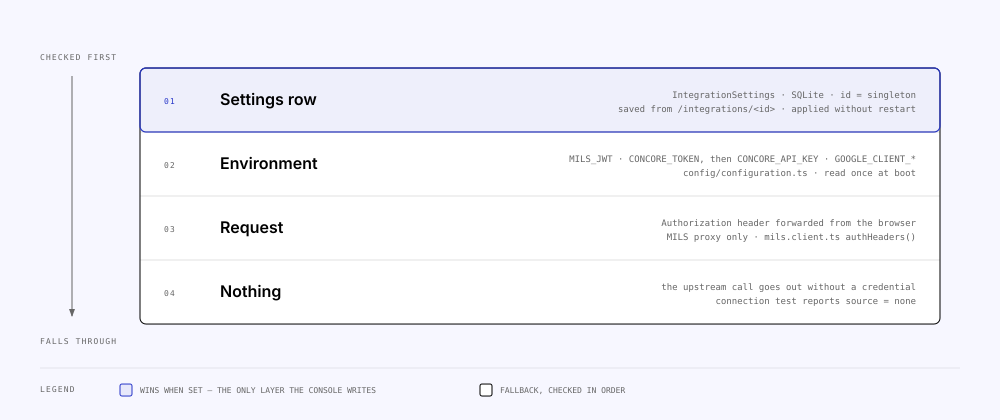

<!-- Generated from the MILS Bridge source repository (docs/operations/configuration.md). Edit it there, not here. -->

# Configuration

Every knob the BFF, the console and the desktop shell read, and where each value
comes from at request time. Upstream connections have two layers — a persisted
Settings row written from the console and environment variables underneath it —
so the same variable can be a hard setting in one deployment and an ignored
fallback in another.

## Where a value comes from

The BFF resolves upstream URLs and credentials **per request** through
`apps/api/src/settings/settings.service.ts`, never from a cached env snapshot,
so a change saved on `/integrations/<id>` applies without a restart.

| Integration  | Settings row field(s)                                                                                       | Env fallback                                                             | Resolution                                                                                                                                                                                         |
| ------------ | ----------------------------------------------------------------------------------------------------------- | ------------------------------------------------------------------------ | -------------------------------------------------------------------------------------------------------------------------------------------------------------------------------------------------- |
| MILS         | `milsBaseUrl`, `signingKeyPem`, `signingKeyPassphrase`, `jwtIssuer/Subject/Audience/KeyId`, `jwtTtlSeconds` | `MILS_BASE_URL`, `MILS_JWT`                                              | Base URL: row, else env. Token: JWT **minted** from the stored key, else `MILS_JWT`, else the browser's forwarded `Authorization` header (`apps/api/src/mils/mils.client.ts`, `authHeaders()`).    |
| Concore      | `concoreBaseUrl`, `concoreApiKey`, `concoreOrgId`                                                           | `CONCORE_BASE_URL`, `CONCORE_TOKEN`, `CONCORE_API_KEY`, `CONCORE_ORG_ID` | Credential: stored API key (+ org header), else env bearer `CONCORE_TOKEN`, else env `CONCORE_API_KEY`, else none (`concoreAuth()`). The stored key deliberately outranks a baked `CONCORE_TOKEN`. |
| Google Drive | `googleClientId`, `googleClientSecret`, `googleRedirectUri`                                                 | `GOOGLE_CLIENT_ID`, `GOOGLE_CLIENT_SECRET`, `GOOGLE_REDIRECT_URI`        | Per field: row, else env (`googleOAuth()`). Per-user Drive tokens are never configuration — they live in `GoogleAccount`.                                                                          |
| API Explorer | — (each imported API carries its own base URL + credential)                                                 | `API_EXPLORER_*` limits only                                             | No node-wide settings slice (`apiExplorerSettingsSchema` is empty in `packages/shared/src/settings.ts`).                                                                                           |

An explicit empty string saved from the console clears the field and falls back
to env (`SettingsService.update()`); the read DTO never returns a secret, only
`has*` flags and a 16-hex-character SHA-256 fingerprint.

## BFF environment variables

Defaults are the values in `apps/api/src/config/configuration.ts`;
`apps/api/.env.example` is the annotated template. Locally the Nest runtime
loads `apps/api/.env` then `.env.local` (`ConfigModule` in
`apps/api/src/app.module.ts`); the CLI scripts load the same two files through
`apps/api/scripts/load-env.ts`, with real environment variables winning. Docker
and the desktop shell inject values directly.

### Server

| Variable         | Default                 | Overridable from Settings | Read by                                            | Notes                                                                                                                                                                                                                                                                     |
| ---------------- | ----------------------- | ------------------------- | -------------------------------------------------- | ------------------------------------------------------------------------------------------------------------------------------------------------------------------------------------------------------------------------------------------------------------------------- |
| `PORT`           | `8080`                  | no                        | `main.ts`                                          | Desktop pins `47800`.                                                                                                                                                                                                                                                     |
| `WEB_ORIGIN`     | `http://localhost:5173` | no                        | `main.ts` (CORS), `metrics/caller.ts`              | Comma-separated allow-list. Also what `classifyCaller` treats as "the console" for `Origin`/`Referer` — a display heuristic, not auth.                                                                                                                                    |
| `DATABASE_URL`   | — (required by Prisma)  | no                        | Prisma, `dashboard/collectors/system.collector.ts` | `file:./prisma/dev.db` in `.env.example`; `file:/data/mapping.db` in both compose files; `%APPDATA%/…/mapping.db` on the desktop.                                                                                                                                         |
| `NODE_ENV`       | unset                   | no                        | `auth/session-cookie.ts`                           | `production` sets the session cookie's `secure` flag (HTTPS assumed). The runtime Docker image and the desktop set it.                                                                                                                                                    |
| `SERVE_WEB_DIST` | unset                   | no                        | `app.module.ts`                                    | Path to `apps/web/dist`; when set the BFF serves the SPA from the same origin (`/api/*` and `/rest/*` excluded). Set by the desktop build and baked into the single distributable image; unset in the two-service compose stacks, where the console is served separately. |
| `LOG_LEVEL`      | `debug` / `log`         | no                        | `main.ts`, `config/log-level.ts`                   | Nest logger levels: `error \| warn \| log \| debug \| verbose`; naming one enables it and everything more severe. Default `debug` outside production, `log` in it. `debug` is where the peer plumbing writes redacted request/response headers and body excerpts.         |

### MILS (target)

| Variable        | Default                           | Overridable from Settings              | Read by                         | Notes                                                                                    |
| --------------- | --------------------------------- | -------------------------------------- | ------------------------------- | ---------------------------------------------------------------------------------------- |
| `MILS_BASE_URL` | `https://mils.dynabloqs.dev/rest` | yes (`milsBaseUrl`)                    | `SettingsService.milsBaseUrl()` | Trailing slash stripped.                                                                 |
| `MILS_JWT`      | empty                             | yes (a stored signing key outranks it) | `MilsClient.authHeaders()`      | Static bearer. Empty + no key ⇒ the browser's `Authorization` header is forwarded as-is. |

### Concore (source)

| Variable             | Default                                    | Overridable from Settings | Read by                                  | Notes                                                                                                                         |
| -------------------- | ------------------------------------------ | ------------------------- | ---------------------------------------- | ----------------------------------------------------------------------------------------------------------------------------- |
| `CONCORE_BASE_URL`   | `https://concore.prod.concular.com/api/v2` | yes (`concoreBaseUrl`)    | `SettingsService.concoreBaseUrl()`       | Trailing slash stripped.                                                                                                      |
| `CONCORE_TOKEN`      | empty                                      | yes (stored API key wins) | `SettingsService.concoreAuth()`          | Bearer (`AuthBearer` scheme). Checked before `CONCORE_API_KEY`. Surfaces as `concoreUsesEnvBearer` in the read DTO.           |
| `CONCORE_API_KEY`    | empty                                      | yes (`concoreApiKey`)     | `SettingsService.concoreAuth()`          | `X-API-Key` header (`AuthAPIKeyWithOrg` scheme).                                                                              |
| `CONCORE_ORG_ID`     | empty                                      | yes (`concoreOrgId`)      | `concoreOrgId()`, `concore/org-scope.ts` | Sent as the org header with an API key; injected as `organisation_id` into allow-listed list reads. Empty ⇒ nothing injected. |
| `CONCORE_ORG_HEADER` | `X-Organization-Id`                        | no                        | `SettingsService.keyHeaders()`           | Header name carrying the org id.                                                                                              |

### Console sessions

| Variable                  | Default      | Overridable from Settings | Read by                   | Notes                                                                      |
| ------------------------- | ------------ | ------------------------- | ------------------------- | -------------------------------------------------------------------------- |
| `SESSION_COOKIE_NAME`     | `bridge.sid` | no                        | `auth/`                   |                                                                            |
| `SESSION_TTL_HOURS`       | `12`         | no                        | `auth/session.service.ts` | Cookie `maxAge` and the row's `expiresAt`. Expired rows are pruned lazily. |
| `AUTH_LOGIN_MAX_ATTEMPTS` | `5`          | no                        | `auth/auth.service.ts`    | Failed logins before a lockout.                                            |
| `AUTH_LOCKOUT_MINUTES`    | `15`         | no                        | `auth/auth.service.ts`    | Lockout duration; the CLI `user:reset-password` clears it.                 |

### Actor API (nodes)

| Variable                            | Default | Overridable from Settings | Read by                                          | Notes                                                       |
| ----------------------------------- | ------- | ------------------------- | ------------------------------------------------ | ----------------------------------------------------------- |
| `ACTOR_JWT_CLOCK_TOLERANCE_SECONDS` | `60`    | no                        | `actor-registry/actor-token-verifier.service.ts` | Skew allowed on `exp` / `nbf`.                              |
| `ACTOR_JWT_MAX_TTL_SECONDS`         | `0`     | no                        | `actor-registry/actor-token-verifier.service.ts` | Reject tokens whose `exp − iat` exceeds this. `0` = no cap. |

### Google Drive (source)

| Variable               | Default | Overridable from Settings  | Read by                         | Notes                                                                                                                                                   |
| ---------------------- | ------- | -------------------------- | ------------------------------- | ------------------------------------------------------------------------------------------------------------------------------------------------------- |
| `GOOGLE_CLIENT_ID`     | empty   | yes (`googleClientId`)     | `SettingsService.googleOAuth()` | OAuth client of type _Web application_.                                                                                                                 |
| `GOOGLE_CLIENT_SECRET` | empty   | yes (`googleClientSecret`) | `SettingsService.googleOAuth()` |                                                                                                                                                         |
| `GOOGLE_REDIRECT_URI`  | empty   | yes (`googleRedirectUri`)  | `SettingsService.googleOAuth()` | Must be registered on the OAuth client verbatim: `<bff origin>/api/integration/google-drive/oauth/callback`. The desktop defaults it to its own origin. |

### File store

| Variable                         | Default               | Overridable from Settings | Read by                            | Notes                                                                                                            |
| -------------------------------- | --------------------- | ------------------------- | ---------------------------------- | ---------------------------------------------------------------------------------------------------------------- |
| `FILE_STORE_DIR`                 | `./data/files`        | no                        | `file-store/file-store.service.ts` | Created on startup. `/data/files` in compose (on the `mapping-data` volume); `%APPDATA%/…/files` on the desktop. |
| `FILE_STORE_MAX_BYTES`           | `209715200` (200 MiB) | no                        | `file-store/`                      | Downloads above this are refused before hitting disk.                                                            |
| `FILE_STORE_DOWNLOAD_TIMEOUT_MS` | `120000`              | no                        | `file-store/`                      | Per Drive download.                                                                                              |

### API Explorer

| Variable                              | Default             | Overridable from Settings | Read by                                      | Notes                                                                                                                                     |
| ------------------------------------- | ------------------- | ------------------------- | -------------------------------------------- | ----------------------------------------------------------------------------------------------------------------------------------------- |
| `API_EXPLORER_ALLOW_PRIVATE_TARGETS`  | unset (blocked)     | no                        | `api-explorer/target-guard.ts`               | Truthy (`1`, `true`, `yes`, `on`) lets imports, base URLs and proxied targets resolve to loopback / private ranges. The desktop sets `1`. |
| `API_EXPLORER_MAX_REQUEST_BYTES`      | `10485760` (10 MiB) | no                        | `main.ts` (raw body parser)                  | Largest body the proxy forwards.                                                                                                          |
| `API_EXPLORER_UPSTREAM_TIMEOUT_MS`    | `60000`             | no                        | `api-explorer/api-explorer-proxy.service.ts` | Per proxied request.                                                                                                                      |
| `API_EXPLORER_CAPTURE_BODY_MAX_BYTES` | `1048576` (1 MiB)   | no                        | `api-explorer/api-exchange.service.ts`       | Bodies above this are truncated in the **recorded** exchange; the upstream body is forwarded whole.                                       |
| `API_EXPLORER_RETENTION_PER_API`      | `500`               | no                        | `api-explorer/api-exchange.service.ts`       | Newest N exchanges kept per API; older unmapped rows pruned on insert. Also the default for `api-explorer:prune`.                         |
| `API_EXPLORER_IMPORT_TIMEOUT_MS`      | `15000`             | no                        | `api-explorer/openapi-import.service.ts`     | Fetching an OpenAPI document by URL.                                                                                                      |

### Access control

| Variable                   | Default        | Overridable from Settings | Read by                                     | Notes                                                                                                                                                                                                                                                                                                                                                                                                                                                                                                                                                                                                                                                                                                                                                                                                                           |
| -------------------------- | -------------- | ------------------------- | ------------------------------------------- | ------------------------------------------------------------------------------------------------------------------------------------------------------------------------------------------------------------------------------------------------------------------------------------------------------------------------------------------------------------------------------------------------------------------------------------------------------------------------------------------------------------------------------------------------------------------------------------------------------------------------------------------------------------------------------------------------------------------------------------------------------------------------------------------------------------------------------- |
| `ACCESS_ENFORCEMENT`       | `shadow`       | no                        | `access/element-access.guard.ts`            | `off` / `shadow` / `enforce`; anything else falls back to `shadow`. Rollout in [`runbooks.md`](runbooks.md).                                                                                                                                                                                                                                                                                                                                                                                                                                                                                                                                                                                                                                                                                                                    |
| `INTEGRATION_ACTOR_WRITES` | `off`          | no                        | `access/element-write.guard.ts`             | `off` / `on`; anything else falls back to `off`. Whether an actor token may write on the integration surface at all — independent of `ACCESS_ENFORCEMENT`.                                                                                                                                                                                                                                                                                                                                                                                                                                                                                                                                                                                                                                                                      |
| `MILS_INTERNAL_AUTH`       | `open`         | no                        | `mils-internal/mils-internal-read.guard.ts` | `open` / `actor` / `node`; anything else falls back to `open`. Whether the item reads on `/rest/*` require a credential and obey the element rules; `node` additionally requires the caller to resolve to a registered MILS node and refuses the anonymous object-access write. **With `open`, `ACCESS_ENFORCEMENT` does not cover item data.**                                                                                                                                                                                                                                                                                                                                                                                                                                                                                 |
| `MILS_TOKEN_AUDIENCE`      | _derived_      | no                        | `actor-registry/self-identity.ts`           | Accepted `aud` on **every** inbound peer token, as a **comma-separated allow-list** — the verifier is shared, so this governs `/api/integration` and `/api/actor-registry/whoami` as well as `mils-internal`, which is why it is not named after one surface. Leave it **unset**: `aud` names the **recipient** in this network, so the expectation is this node's own names, `<our code>-rest-api` and `<our code>-mils-api`. **Setting it pins the list**, replacing those names and answering a uniform 401 to a peer addressing us by any other — there is a boot warning saying so. A defined-but-empty value skips the check entirely. What we stamp _outbound_ is the recipient's: `mils-rest-api` for MILS (Settings `jwtAudience` overrides), each peer's own from its registry row. See [`security.md`](security.md). |
| `MILS_ACTOR_CODE_SELF`     | unset → `conc` | **yes**                   | `actor-registry/self-identity.ts`           | This deployment's own MILS `ActorCode`: it decides the `aud` **we stamp** on every outbound token (`<code>-rest-api`) and the `sub` beside it. It does _not_ decide what we accept — that is the caller's own code. Settings win over it. `conc` is Concular's own MILS actor, so a **fork or white-label deployment must change it** — one field on the MILS settings page, or this variable. Falling back to it logs a boot **warning**: nothing else fails when a node introduces itself as somebody else.                                                                                                                                                                                                                                                                                                                   |
| `MILS_INTERNAL_AUDIENCE`   | unset          | no                        | `config/configuration.ts`                   | **Deprecated alias** for `MILS_TOKEN_AUDIENCE`, honoured when the new name is unset and logged as a warning at boot. Rename it; nothing else changes.                                                                                                                                                                                                                                                                                                                                                                                                                                                                                                                                                                                                                                                                           |

### Peer federation

Reading a peer-owned MILS item from the node that owns it. **Off by default**,
and off means the routes do not exist: `PeerModule` registers no controller, so
`/api/integration/peer/*` answers a router **404** rather than a 403 — a
capability a deployment has declined should not advertise itself.

Its own switch because it is the only outbound capability whose destination is
not configured (MILS data chooses the host) and the only one with an outbound
**write**. See [`actors-and-nodes.md`](actors-and-nodes.md)
§ Federated reads and [`security.md`](security.md).

| Variable                        | Default               | Overridable from Settings | Read by                                   | Notes                                                                                                                                                                                                                                                                                                                                                       |
| ------------------------------- | --------------------- | ------------------------- | ----------------------------------------- | ----------------------------------------------------------------------------------------------------------------------------------------------------------------------------------------------------------------------------------------------------------------------------------------------------------------------------------------------------------- |
| `PEER_FEDERATION`               | `off`                 | no                        | `peer/peer.module.ts`                     | `off` / `on`; **anything else falls back to `off`**, including the truthy values (`1`, `true`) the other flags accept — off here is a documented posture, not the absence of a truthy value. Both compose files pass it through bare, with no `${…-on}` default.                                                                                            |
| `PEER_ALLOW_PRIVATE_TARGETS`    | unset (blocked)       | no                        | `peer-transport/peer-target.guard.ts`     | Truthy lets a peer resolve to loopback / RFC1918 / ULA **and** relaxes the `https` requirement. Without it a plaintext `http://` host name is refused: a token signed with this node's private key does not travel in the clear because MILS has a typo. Set it for two instances on one machine.                                                           |
| `PEER_FETCH_TIMEOUT_MS`         | `15000`               | no                        | `peer-transport/peer-http.service.ts`     | Per peer request — every leg, the Nodes-tab probe and the loopback included: one request shape, one timeout.                                                                                                                                                                                                                                                |
| `PEER_DATA_MAX_BYTES`           | `262144` (256 KiB)    | no                        | `peer/peer-client.service.ts`             | Cap on an `ItemData` body — 4× `ITEM_PAYLOAD_MAX_BYTES`, because a peer's own limit is a peer's business but finite. Enforced on the stream; over it answers the `TOO_LARGE` outcome, not a 500.                                                                                                                                                            |
| `PEER_FILE_MAX_BYTES`           | `209715200` (200 MiB) | no                        | `peer/peer-client.service.ts`             | The same for a streamed `ItemFile`, matching `FILE_STORE_MAX_BYTES` so the two "a file arrived from outside" limits agree.                                                                                                                                                                                                                                  |
| `PEER_ACCESS_GRANTED_STATES`    | `1`                   | no                        | `peer/peer-access-state.ts`               | Comma-separated `ObjectAccessState` values read as **granted**.                                                                                                                                                                                                                                                                                             |
| `PEER_ACCESS_DENIED_STATES`     | `2`                   | no                        | `peer/peer-access-state.ts`               | The same, read as **denied**. Anything in neither list — **`0` included** — is **pending**.                                                                                                                                                                                                                                                                 |
| `PEER_TRACE`                    | `on`                  | no                        | `peer-transport/peer-exchange.store.ts`   | Write one `PeerExchange` row per outbound peer call — what we sent (bearer as a digest with its decoded claims, cookies dropped, header values capped), what came back (status, headers, the first bytes of a text body), and what the socket saw (addresses, TLS certificate, per-phase timings). `off` keeps the `HTTP:Peer` log line and writes nothing. |
| `PEER_TRACE_RETENTION_PER_NODE` | `200`                 | no                        | `peer-transport/peer-exchange.store.ts`   | Newest rows kept per node, within 31 days; pruned lazily on insert like `ApiExchange`.                                                                                                                                                                                                                                                                      |
| `PEER_TRACE_BODY_MAX_BYTES`     | `4096`                | no                        | `peer-transport/peer-http.service.ts`     | How much of a peer's **text** answer is kept as an excerpt, in the log at `debug` and in the exchange row. Payload streams are never excerpted; a non-2xx on a payload route is.                                                                                                                                                                            |
| `PEER_AUTH_EVENTS_MAX`          | `2000`                | no                        | `actor-registry/peer-auth-log.service.ts` | Refused-peer-token rows kept (`PeerAuthEvent`), within 31 days. Identical rejections (same token digest, same reason) within a minute collapse into one row with a count.                                                                                                                                                                                   |
| `PEER_TOKEN_EXPORT`             | `on`                  | no                        | `node-registry/self-check.service.ts`     | Whether an ADMIN may mint a short-lived (≤ 15 min) token to hand to a peer's operator for **their** inspector (`POST …/node-registry/self/token`, audited by digest). `off` removes the route — 404, like `PEER_FEDERATION`.                                                                                                                                |

#### Why the access-state mapping is configuration

`mils-internal.yaml` types `ObjectAccessState` as `number/int64` and publishes
**no enumeration**, so this is the one place the contract asks a node to
interpret a number it does not define. Hardcoding a guess risks reading a peer's
_refusal_ as a yes, which is the worst failure this feature can have; treating
any `200` on the state read as a grant makes the field decoration.

So the mapping is configured, and two properties make that safe:

- **an unrecognised state is _pending_.** Being wrong costs a read that does not
  happen rather than one that should not have. `0` — the column default on both
  sides — is pending, never granted;
- **the raw number travels.** `PeerItemAccessDto.accessState` carries the peer's
  value verbatim and the sentence names the variable, so an operator meeting a
  new network convention sees the number, reads which variable governs it, and
  fixes it in one step without reading our source.

Non-numeric and empty entries in either list are **ignored** rather than thrown
on: a typo must not stop a node booting, and the entry it drops lands in the
pending bucket anyway. (`Number('')` is `0`, so an empty entry is dropped before
it can become the one state that must never read as a grant.)

### Secrets at rest

| Variable          | Default | Overridable from Settings | Read by                      | Notes                                                                                                                                                                                              |
| ----------------- | ------- | ------------------------- | ---------------------------- | -------------------------------------------------------------------------------------------------------------------------------------------------------------------------------------------------- |
| `SECRETS_KEY`     | unset   | no                        | `common/secret-box.ts`       | 32 bytes, base64 or hex - `openssl rand -base64 32`, or `node -e "console.log(require('node:crypto').randomBytes(32).toString('base64'))"` (more ways in `.env.example`). Encrypts the credential columns with AES-256-GCM. Unset keeps them stored as typed. Boot **fails** if encrypted rows exist and this is unset. |
| `SECRETS_KEY_OLD` | unset   | no                        | `scripts/encrypt-secrets.ts` | Only for `encrypt:secrets --rotate`: the key the rows were written with.                                                                                                                           |

### Rate limiting

| Variable               | Default | Overridable from Settings | Read by         | Notes                                                                                                                                                                                                                                                |
| ---------------------- | ------- | ------------------------- | --------------- | ---------------------------------------------------------------------------------------------------------------------------------------------------------------------------------------------------------------------------------------------------- |
| `THROTTLE_TTL_SECONDS` | `60`    | no                        | `app.module.ts` | Window length for the global bucket.                                                                                                                                                                                                                 |
| `THROTTLE_LIMIT`       | `300`   | no                        | `app.module.ts` | Requests per window per client. `POST /rest/MilsObjectAccesses`, `POST /api/auth/login` and `POST /api/auth/setup` declare 10/min instead.                                                                                                           |
| `TRUST_PROXY`          | unset   | no                        | `main.ts`       | Express `trust proxy`, verbatim (a hop count, `true`, or a subnet list). **Required behind a reverse proxy** or every request shares the proxy's address — and dangerous if set for an untrusted one, since `X-Forwarded-For` then becomes a bypass. |

### Script-only

| Variable              | Default | Read by                                | Notes                                                                 |
| --------------------- | ------- | -------------------------------------- | --------------------------------------------------------------------- |
| `MILS_KEY_PASSPHRASE` | unset   | `apps/api/scripts/load-signing-key.ts` | Alternative to `--passphrase`, keeps the secret out of shell history. |

## Console (`apps/web`)

| Variable              | Default                                                | Read by                                     | Notes                                                                                                                                                                                                                                                                                                                                                                                                                                                             |
| --------------------- | ------------------------------------------------------ | ------------------------------------------- | ----------------------------------------------------------------------------------------------------------------------------------------------------------------------------------------------------------------------------------------------------------------------------------------------------------------------------------------------------------------------------------------------------------------------------------------------------------------- |
| `VITE_API_BASE_URL`   | same origin (prod build), else `http://localhost:8080` | `apps/web/src/app/config/base-url-store.ts` | The BFF origin the browser calls (`/api/*` appended). **Baked into the bundle at build time** — the two-image production stack takes it as a build arg; rebuild the web image to change it. Left unset in a production build the console calls **its own origin**, which is what the single distributable image relies on (the BFF serves the bundle itself). A user can override it at runtime from the console's API-origin setting (stored in `localStorage`). |
| `CHOKIDAR_USEPOLLING` | unset                                                  | `apps/web/vite.config.ts`                   | Dev only: polling file watcher, set by `docker-compose.dev.yml` because inotify events do not cross the Windows bind mount.                                                                                                                                                                                                                                                                                                                                       |

## Desktop (`apps/desktop`)

`apps/desktop/src/main.ts` spawns the BFF with a fixed environment; a real
environment variable of the same name still wins for `GOOGLE_REDIRECT_URI` and
`API_EXPLORER_ALLOW_PRIVATE_TARGETS`.

| Variable                                                     | Value set by the shell                                                          |
| ------------------------------------------------------------ | ------------------------------------------------------------------------------- |
| `ELECTRON_RUN_AS_NODE`                                       | `1` — the BFF runs on Electron's bundled Node                                   |
| `NODE_ENV`                                                   | `production`                                                                    |
| `PORT` / `WEB_ORIGIN`                                        | `47800` / `http://localhost:47800`                                              |
| `DATABASE_URL`                                               | `file:<userData>/mapping.db`                                                    |
| `SERVE_WEB_DIST`                                             | the staged `apps/web/dist`                                                      |
| `FILE_STORE_DIR`                                             | `<userData>/files`                                                              |
| `GOOGLE_REDIRECT_URI`                                        | `http://localhost:47800/api/integration/google-drive/oauth/callback` unless set |
| `API_EXPLORER_ALLOW_PRIVATE_TARGETS`                         | `1` unless set — the BFF runs on the user's own machine                         |
| `PRISMA_QUERY_ENGINE_LIBRARY`, `PRISMA_SCHEMA_ENGINE_BINARY` | the bundled Windows engines, when found                                         |

## Related

- [`deployment.md`](deployment.md) — which of these each compose file and the desktop actually set.
- [`security.md`](security.md) — where the secrets these variables seed end up.
