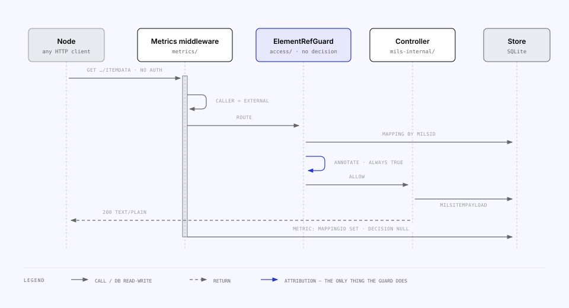
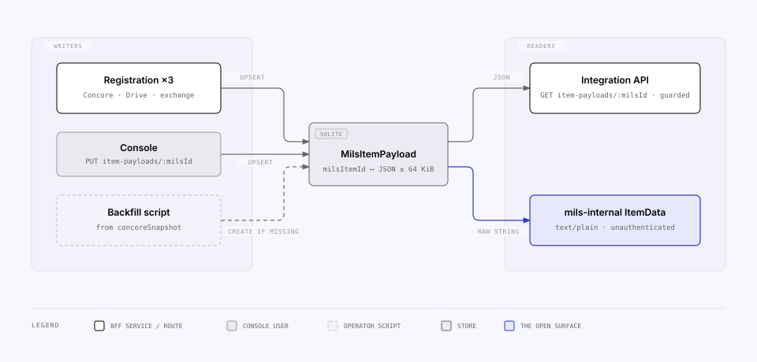

<!-- Generated from the MILS Bridge source repository (docs/features/mils-internal-api.md). Edit it there, not here. -->

# The mils-internal API

`/rest/*` is the `apps/web/mils-internal.yaml` API — the MILS-shaped endpoints a
node calls to fetch a registered item's data — **implemented locally by the BFF
from its own store**, not forwarded to MILS. `/rest` is a MILS node's REST root:
the same root upstream MILS serves `/Items` under, and the one the BLM document
publishes (`https://blockmaterials.dynabloqs.dev/rest/MilsObjectAccesses`). The
surface keeps its internal name, `mils-internal`; only the URL is the network's.
It is deliberately unauthenticated: a node needs no token, cookie or credential
to read it, so the BFF attributes each read to an element for the statistics
but never decides whether to serve it.

Owned by `apps/api/src/mils-internal/`; the spec is
`apps/web/mils-internal.yaml` — the BLM document ("BLM - OpenAPI 3.0" v1) as
this BFF serves it. Every operation it declares is now implemented; each
description says which local store answers it. The console's
`internal-client.ts` targets it without credentials.

## Endpoints

| Method | Path                                     | Guard    | Backing table       | Answers                                                                                                                                                                                                                                                |
| ------ | ---------------------------------------- | -------- | ------------------- | ------------------------------------------------------------------------------------------------------------------------------------------------------------------------------------------------------------------------------------------------------ |
| `GET`  | `/rest/MilsItems/:objectId/ItemData`     | `none`   | `MilsItemPayload`   | The stored payload **verbatim** as `text/plain; charset=utf-8`; `404` when no payload is stored for that item                                                                                                                                          |
| `GET`  | `/rest/MilsItems/:objectId/BinaryData`   | `none`   | `StoredFile` + disk | The same bytes **base64-encoded** as `text/plain; charset=utf-8` — the BLM contract types this response as a plain string; same `ETag`, `If-None-Match`, `404` and `410` as `ItemFile`                                                                 |
| `GET`  | `/rest/MilsItems/:objectId/ItemFile`     | `none`   | `StoredFile` + disk | The bytes of the file registered as this item, with its stored `Content-Type`, `ETag` (quoted sha256) and `Content-Disposition`; honours `If-None-Match`; `404` when no stored file, **`410 Gone`** when the blob is missing on disk                   |
| `GET`  | `/rest/MilsItems/:objectId/PropertyData` | `none`   | `MilsItemPayload`   | The stored property data **verbatim** as `text/plain; charset=utf-8`; `404` when none is stored. Opaque text — the contract types the 200 as a plain string, and this node does not validate it against the item type's property schema                |
| `GET`  | `/rest/MilsItems`                        | `none`\* | `ResourceMapping`   | `{ AvailableRowCount, MilsItems: [{ ItemId, ObjectId, ItemDescription }] }` for one `ObjectId` **and** one `ItemTypeId`, both required; optional `FilterText`, `SkipRowCount`, `MaxRowCount` (default 50, max 200). \*No `ElementRefGuard` — see below |
| `POST` | `/rest/MilsObjectAccesses`               | posture  | `MilsObjectAccess`  | `201 { ObjectId, ObjectAccessState }` — the braced **object** id the registration covers, and this node's **own access decision** for it (below). Idempotent: one row per (caller, object), re-decided and re-counted on every ask                     |
| `GET`  | `/rest/MilsObjectAccesses/:objectId`     | posture  | `MilsObjectAccess`  | `{ ObjectAccessState, ObjectId }` for a MILS **Object** id **or** an access record's own id; **never `404`** for a well-formed id — with no row it answers the decision a POST would have. `400` for a malformed one                                   |

The **Guard** column is the default `open` posture: `none` means no credential
is checked there, and `posture` means the route always follows
`MILS_INTERNAL_AUTH` — including in `open`, where that resolves every caller to
the same anonymous principal. What each posture changes for each route is the
table under [§ Why it is unauthenticated](#why-it-is-unauthenticated--and-how-to-change-that).

The usual MILS brace rule applies: path parameters are bare uuids, body GUIDs
are braced (`toBracedMilsId` / `normalizeMilsId` in
`apps/api/src/common/mils-ids.ts`; the POST body is validated against a braced
GUID regex in `mils-internal.schemas.ts`). `ItemData` and `PropertyData` set the
content type explicitly because Express would otherwise send a string body as
`text/html`. Note the path parameter on all four item reads is named `ObjectId`
and is in fact an **ItemId** — a naming wart of the BLM document, kept so the
paths match it verbatim.

`BinaryData` and `ItemFile` are two endpoints over one blob, not aliases:
`BinaryData` is the BLM contract's own operation and answers with base64 text,
`ItemFile` is a BFF extension that streams the bytes verbatim with the file's
content type and `Content-Disposition`. Both encode while streaming, so a
200 MiB file never lands in memory (`sendStoredFileBase64` / `sendStoredFile` in
`apps/api/src/file-store/send-stored-file.ts`).

### What the list enumerates, and why it is `ResourceMapping`

`GET /MilsItems` is the one read on this surface backed by `ResourceMapping`
rather than the payload store, and that is a correctness requirement, not a
convenience. The `MilsObjectAccesses` handshake answers for an **Object** by
folding the access decisions of every element under it —
`ElementRefResolver.byMilsObjectId`, over `ResourceMapping.milsObjectId`. If the
list enumerated `MilsItemPayload.objectId` instead (documented in the schema as
a non-authoritative provenance snapshot), the two operations would describe
different objects: a peer could be granted an object whose items the list omits,
or see an item in the list the grant never considered. So `listItems` calls the
same resolver the handshake does, then narrows by `itemTypeId`.

Three consequences worth knowing:

- **`ItemTypeId` is required and stored.** `ResourceMapping.itemTypeId` is
  written by the three registration services from the same value they send to
  MILS. Rows registered before that column existed carry `null` and are
  therefore invisible to this endpoint until `backfill:mils-object-ids` has run
  — the list answers _nothing_ for them, rather than answering wrongly.
- **`ItemDescription` is derived locally.** MILS publishes no description for an
  Item, on `/Items` or on `/Items/{id}` — it is a BLM-only field, so there is
  nothing to mirror. The value is `displayNameFor(mapping)`
  (`access/element-display-name.ts`), the same snapshot-derived name the Access
  tables, the dashboard and the Statistics tab show. Its fallback always
  produces a name, so the field is never empty.
- **Only `REGISTERED` items appear.** An archived element is one an operator
  withdrew; publishing it in an enumeration would undo that. `ItemData` still
  serves an archived item today, so the two disagree at that edge — making them
  agree is a separate compatibility question.

`FilterText` is a case-insensitive substring match over that derived
description, and both it and the access filter run in JS, after SQL. So
`filterAndPage` (`mils-internal/mils-item-list.ts`) materialises, filters,
counts and _then_ slices: `AvailableRowCount` is defined as the total
independent of paging, and it has to describe the set the page was cut from.
The candidate set is bounded by one object × one item type, so materialising it
is cheap.

`MilsObjectAccess` rows are free-standing — the target object need not exist in
any other local table. `accessState` is no longer a permanent `0`: the write
answers with the access model's own decision, and the row also records who asked
(`nodeId`, `actorId`) and which rule decided (`decisionSource`). See § The other
direction, below.

There is **one row per (caller, object)**, keyed `(principalKey, objectId)` —
`node:<id>` · `actor:<id>` · `anonymous`, derived by `principalKeyFor`. A repeat
ask re-decides that row and bumps `askCount`/`lastAskedAt` rather than filing
another, which is what makes the POST safe to retry and keeps the row readable
as "what did we answer this peer about that building?". `principalKey` is
non-null because SQLite counts NULLs as distinct in a unique index — the same
reason `ElementAccessRule` and `ElementNodeAccessRule` are two tables. Retention
prunes on `lastAskedAt`, so a registration that is still being checked does not
vanish at 31 days.

## A read, step by step



1. The request arrives with no credential. The metrics middleware classifies
   the **caller** — `external` unless a session cookie or an allow-listed
   `Origin`/`Referer` marks it as the console's own read (`classifyCaller` in
   `apps/api/src/metrics/caller.ts`).
2. `ElementRefGuard` (`apps/api/src/access/element-ref.guard.ts`) resolves
   which mapping the item belongs to (`ElementRefResolver.byMilsId` for
   `ItemData`, `byStoredFile` for `ItemFile` and `BinaryData`), annotates the
   `mappingId` on the request, and **always returns `true`**. No decision, no `ACCESS_ENFORCEMENT`
   read, no `403`.
3. The controller answers from the store.
4. The middleware writes one `RequestMetric` row: `surface = mils-internal`,
   `caller`, the matched route pattern, status, duration, `mappingId` — and
   `decision = null`, because none was made.

Two properties of the guard are deliberate:

- **A guard, not an interceptor** — the annotation must be in place before the
  response finishes, and the resolver needs `req.route` / `req.params`; both
  are true of a guard, which runs after routing.
- **Independent of `ACCESS_ENFORCEMENT`** — `ElementAccessGuard` short-circuits
  when enforcement is `off`; attribution must not, or turning enforcement off
  would quietly empty a statistics page that has nothing to do with
  enforcement. Attribution is not enforcement.

This is what lets _Access → Statistics_ answer "which of our elements are being
read, by whom (console vs external), with what outcome" on a surface where
`principalType` is always `none`
(`dashboard-audit-statistics.md`).

## Why it is unauthenticated — and how to change that

The spec describes the interface a MILS node expects from another node. There
is no identity in that contract to verify, so by default the BFF exposes it
as-is: anyone who can reach the BFF can read stored payloads, download stored
file bytes and create or read access records on this surface.

That default has a consequence worth stating plainly: **with
`MILS_INTERNAL_AUTH=open`, `ACCESS_ENFORCEMENT` does not protect item data.** A
node blocked from an element on `/api/integration/item-payloads/:milsId` reads
the same bytes at `/rest/MilsItems/:milsId/ItemData`. Enforcement
that is bypassable is worse than none, because it is believed.

So the posture is a deployment choice (`MilsInternalReadGuard`):

| `MILS_INTERNAL_AUTH` | The four item reads                                                                                                                                                                                               | `GET /MilsItems` | The two `MilsObjectAccesses` routes |
| -------------------- | ----------------------------------------------------------------------------------------------------------------------------------------------------------------------------------------------------------------- | ---------------- | ----------------------------------- |
| `open` (default)     | `ElementRefGuard` only — attribution, never a decision. The contract as written, so an upgrade changes nothing for conformant peers.                                                                              | open             | open (every caller is `anonymous`)  |
| `actor`              | `IntegrationAuthGuard` (console session **or** actor JWT) then `ElementAccessGuard` — the same credential and the same rules as the `/api/integration` reads. Deviates from the published contract, deliberately. | credential only  | open (every caller is `anonymous`)  |
| `node`               | The same, and the caller must resolve to a **registered MILS node** — see [`actors-and-nodes.md`](actors-and-nodes.md). Answers _which peer_ is reading, which `actor` cannot when one actor owns several nodes.  | resolved node    | requires a resolved node            |

**The list takes the credential and not the decision** (`MilsInternalListGuard`
— `IntegrationAuthGuard` plus, in `node` mode, the same `requireResolvedNode`
the read and write guards use). There is no single element to decide about: a
list is about many, `ElementRefGuard` annotates one `RequestMetric.mappingId`,
and `ElementAccessGuard` answers one ALLOW/BLOCK. So the decision moves into the
handler, batched through `AccessDecisionService.visibleTo` — the same function
over the same rows as the per-element reads — and applies only under
`ACCESS_ENFORCEMENT=enforce`, because filtering a list _is_ enforcement and
`shadow`'s contract is that nothing is actually withheld. Its exposure is
therefore exactly `ItemData`'s in every posture: at `open`, a caller who knows
an `ObjectId` and an `ItemTypeId` can enumerate what this node registered under
them, which is the same disclosure `ItemData` already makes one item at a time.

**What a conforming peer sends** in the two guarded modes: a bearer RS256 JWT
carrying **one of our** names as its audience — `aud: <our actor code>-rest-api`
or `<our actor code>-mils-api` — plus `iss` = its actor's `ActorTokenIssuer` and
`sub` = its actor's `ActorCode`. `aud` names the **recipient** in this network,
so a peer that stamps _its own_ audience is reading the convention the other way
round and is refused; a peer that needs the exact values can read them from
`GET /api/actor-registry/whoami` (field `audience`), which is authenticated and
returns nothing a holder of a valid token does not have. The convention is
spelled out in the published spec's `bearerAuth` description and in
[`actors-and-nodes.md`](actors-and-nodes.md), and a deployment can pin the
accepted list with `MILS_TOKEN_AUDIENCE` — which then **replaces** our own names
with exactly what it lists. Note the token names **no node**: under `node` it
binds to one only when its actor owns exactly one enabled node, and otherwise
must add the `X-MILS-Node-Id` header.

A peer-facing walkthrough of all of this — what to send, how it is validated and
cURL for each call — is
[`peer-node-onboarding.md`](peer-node-onboarding.md).

**Where our surface answers.** The network's convention puts a node's
node-to-node API at its REST root, `<host>/rest` (`MILS_REST_PATH` in
`@bridge/shared`, imported by both the inbound mount and the outbound
derivation so the two cannot drift), which is how this BFF derives a peer's URL
and how a peer derives ours — so this is the one surface that sits **outside the
BFF's global `api` prefix**: `main.ts` excludes the whole `/rest` prefix and the
controller declares it, so the address a peer computes is the address we serve.
Until 2026-09-03 this repo served and addressed `/rest/api/mils-internal`, a
segment of its own invention that no peer ever used; that path now answers 404
(`mils-rest-root-path-plan.md`).
There is no `/api/mils-internal` alias; that path is gone, and the console reads
the conventional one too. A reverse proxy still has to route the prefix to the
BFF ([`deployment.md`](deployment.md)), and `main.ts`
asserts the mount point at boot rather than letting a peer discover a silent
move as a 404.

`ElementRefGuard` runs on the item reads in **all three** modes, before any
decision: attribution is not enforcement, and switching back to `open` must not
empty a statistics page that has nothing to do with enforcement. In the guarded
modes the element is resolved twice — once to attribute, once to decide — which
keeps the two guards independent for the price of one indexed lookup. It does
**not** run on the list, whose `RequestMetric.mappingId` stays null; the row
still counts, under the `item-list` endpoint.

**Reads and the one write follow the same posture.** `POST /MilsObjectAccesses`
is a free row-insert primitive: no credential, no id needed, and the target
object need not exist anywhere else. `open` and `actor` leave it as the contract
has it — the document declares no scheme there, and `actor` is about element
reads — but `node` is the first posture where an identity actually exists at
that route, so it is the first where refusing an anonymous write is possible
rather than merely desirable. The rate limit (10/min per client) applies in
every mode, and rows are pruned after 31 days.

The object-access **read** now follows the same posture
(`MilsInternalStateGuard`), which it did not before. While its id could only be
an access record's, staying open was defensible: a server-generated uuid is a
capability in practice, and the route disclosed one state number for an id the
caller already held. Its id may now also be a MILS **Object** id — published by
MILS, present in every item body, known to every peer — and the answer is _this
caller's_ access, so answering it requires knowing who is asking. Under `open`
and `actor` nothing is checked and every caller resolves to the shared
`anonymous` principal, whose row and whose live decision are the ones an
anonymous POST gets.

Restricting who can reach the BFF at all remains a deployment concern
([`security.md`](security.md)).

## The other direction: this node as a caller

The contract is symmetric, and since federated reads this BFF is on both sides
of it. It **calls** three of its own operations against a peer — a resolve by
id, never a browse:

| Called on a peer                          | Why                                                                                                                                                                                                                    |
| ----------------------------------------- | ---------------------------------------------------------------------------------------------------------------------------------------------------------------------------------------------------------------------- |
| `POST /MilsObjectAccesses`                | ask permission **for the object the item belongs to**. The one outbound **write** this BFF makes, with a fixed path and a body of exactly one id                                                                       |
| `GET /MilsObjectAccesses/{handle}`        | read the `ObjectAccessState` — **only when the `201` did not carry one**, and again for _Check again_. The handle is whatever that `201` gave: an access record id, or (as this node now answers) the object id itself |
| `GET /MilsItems/{id}/{ItemData,ItemFile}` | the payload — **only** when the state reads as granted                                                                                                                                                                 |

The whole flow, the switches that gate it and the loop argument are in
[`actors-and-nodes.md`](actors-and-nodes.md) § Federated reads. Two properties
belong here, next to the contract they read:

- **The handshake is a gate, not a formality.** `PeerClientService` calls
  `PeerAccessService.ensureGrant()` first and does not open a socket to
  `ItemData` unless the grant is `GRANTED`. There is no configuration that skips
  it: a peer that serves `ItemData` but not `MilsObjectAccesses` is an incomplete
  implementation of this contract, and the honest answer is a sentence naming the
  missing operation rather than a switch that helps ourselves anyway.
- **`ObjectAccessState` is interpreted, because the contract does not define
  it.** `mils-internal.yaml` types it as `number/int64` and publishes no
  enumeration, so `PEER_ACCESS_GRANTED_STATES` / `PEER_ACCESS_DENIED_STATES`
  (default `1` / `2`) decide, and everything else — **`0` included** — is
  _pending_. Being wrong therefore costs a read that does not happen rather than
  a peer's refusal read as consent. The raw number travels in the DTO and onto
  the screen, because our reading of it is local configuration and the operator
  has to be able to see what was actually said.

### What this node answers, as the callee

`POST /MilsObjectAccesses` used to insert `accessState: 0` — "semantics TBD" —
and nothing ever changed it. Two instances of this BFF federating with each
other would have sat in _pending_ forever, so the write now publishes a real
decision, and **it is a decision this node already makes**:

```
POST /MilsObjectAccesses { ObjectId }          ← a MILS Object, never an item
  → every element under it (ResourceMapping.milsObjectId), may be none
  → resolveAccess(policy, principal, element)  ← the same function the element
                                                 reads go through
  → any ALLOW → accessState 1 · otherwise 2 · no principal → 0 (pending)
```

**`ObjectId` is an Object.** Until 2026-09-04 both halves of this BFF put an
**item** id in that field, which two of our own nodes tolerated because both
were wrong the same way; a conforming peer finds nothing for it and answers from
its default policy, which reads back here as a refusal it never made
(`plans/mils-object-scoped-access-plan.md`). One grant now covers every item of
that object the granting node owns. The fold across those elements is
**any-allows**, and the per-element guard still governs each read — see
[`access-control.md`](access-control.md) § The same resolver also answers
inbound access requests.

`mils-internal/object-access-decision.ts` is that mapping, and the values are
the caller side's own defaults on purpose: the contract publishes no
enumeration, so two implementations that have to interoperate need _a_
convention, and this is ours — stated once on each side, overridable by
configuration on the reading side, and pinned by a test that reads back what the
other half publishes.

`MilsObjectAccess` carries `nodeId`, `actorId`, `decisionSource` and
`mappingId` alongside the state. The ids are nullable and none is a foreign
key — an anonymous request has no principal, and a row must outlive the mapping
it named — and together with the state the row **is** the "who asked for what,
and what we answered" log, which is why federation needs no separate exchange
table on this side either. The console shows those rows per peer under
_Access → Nodes → Diagnostics → Access requests received_, joined on `mappingId`
to the element the answer came from. (Joined on the element rather than on the
requested id, because the requested id is an object and names no single
element.)

What this surface **refuses** is recorded too. Under `actor` and `node` posture
every rejected token becomes a `PeerAuthEvent` row — route pattern, remote
address, `X-MILS-Node-Id`, the token's digest and decoded claims, how far the
resolution ladder got, and the reason — written by `PeerAuthLogService` from the
`TokenRejection` the verifier throws, while the caller still receives the uniform
`401 Invalid actor token.`. The `node`-posture refusal ("resolved to an actor
but names no node") goes through the same path. See
[`actors-and-nodes.md`](actors-and-nodes.md) § Seeing the network.

Four rulings worth stating plainly:

- **`0` stays pending, and it is what an anonymous request gets.** Under `open`
  or `actor` posture the POST carries no node, so there is nobody to decide
  about; recording the request and granting nothing is the honest answer. A
  console session gets the same treatment: an operator poking their own node's
  handshake is not a peer whose access there is anything to decide.
- **`ACCESS_ENFORCEMENT` does not gate this write.** That switch decides whether
  we _act_ on a decision when serving an element read; here we are publishing a
  decision, not enforcing one. Keeping one meaning per switch matters more than
  surface symmetry — and a node running `shadow` that answered `0` to every
  request would be silently unreadable for a reason no operator could find.
  **The asymmetry is real**: a `shadow` deployment can grant a request and then
  serve a payload it would otherwise have blocked, because the item reads stay
  governed by `ACCESS_ENFORCEMENT` exactly as they are today. That is what
  `shadow` means, and it is written down here rather than papered over.
- **A missing element is not special-cased.** An access request names an
  arbitrary MILS object this node may hold no mapping for; `resolveAccess`
  already falls through to the principal's default and then the global policy,
  whose own default is `BLOCK`. Fail-closed, by the same ladder.
- **`GET /MilsObjectAccesses/{id}` never answers `404` for a well-formed id.**
  A peer integrating against this surface reported the old 404 as a hard
  blocker: their HTTP component throws on it, so "nobody has asked yet" killed
  the exchange where the honest answer was a state. A missing record is not a
  missing resource — the endpoint exists to publish a state, and the state for
  an object nobody has asked about is the one a POST would answer with
  (fail-closed, so `2` for a stranger). It also means probing object ids here
  discloses nothing about what this node holds, which a `404`/`200` split would.
  `400` still answers a malformed id.
- **A GET answers what a POST would answer, minus the write** — for an object
  with no row. One `decide()`, two entry points: a live branch that could
  publish a state the fold cannot is a second access model.
- **Where a row exists, the row wins.** A stored state is the answer this node
  gave, so a GET replays it rather than re-deciding — which is what the
  contract's other implementation asked for and what makes a poll cheap. So an
  operator's later change in _Access → Elements_ surfaces on the peer's next
  **POST** (which re-decides), not on its next GET. Safe rather than merely
  tolerable: a stale `1` grants nothing by itself, because `ElementAccessGuard`
  still decides every item read.
- **A grant is keyed at the root of the object tree, and covers its subtree.**
  An ask about an object under a root is answered, stored and echoed as an ask
  about that root (`ResourceMapping.milsRootObjectId`), so one record covers a
  site. The fold then spans every element beneath it — wider than it was, and
  written up where an operator will read it in
  [`access-control.md`](access-control.md). The root is read from this node's
  own rows: the tree is walked at registration, never on an inbound request, so
  these unguarded routes still make no upstream call.

There is **no grant UI**. An operator changes an answer where they already change
access — _Access → Elements_, per node. Deriving the grant from `resolveAccess`
is what buys that for free; a screen that decided grants separately would be a
second access model.

## Where the payload comes from



| Writer                                                                                            | When                                                       | Behaviour                                                                                                                                                    |
| ------------------------------------------------------------------------------------------------- | ---------------------------------------------------------- | ------------------------------------------------------------------------------------------------------------------------------------------------------------ |
| `RegistrationService` (Concore)                                                                   | On `REGISTERED`, keyed by the new `ItemId`                 | Upserts the Concore snapshot if it is a JSON object; best-effort — a store failure never fails the registration, the `SUCCESS` log records `payloadStored`   |
| `DriveRegistrationService`                                                                        | On `REGISTERED`, and again on re-sync                      | Upserts the `StoredFileDto` descriptor (name, mime, size, sha256, links) — `ItemFile` serves the bytes it describes; best-effort                             |
| `ExchangeRegistrationService`                                                                     | On `REGISTERED`                                            | Upserts the exchange payload; its size against `ITEM_PAYLOAD_MAX_BYTES` is checked **before** the MILS item is created                                       |
| `PUT /api/integration/item-payloads/:milsId` (`apps/api/src/item-payload/`)                       | Manually, from the console                                 | Any JSON object ≤ 64 KiB, optional provenance columns, and the **only** writer of `propertyData`; `400` above the cap                                        |
| `pnpm --filter @bridge/api backfill:item-payloads` (`apps/api/scripts/backfill-item-payloads.ts`) | For mappings registered before registration wrote payloads | Creates rows from `ResourceMapping.concoreSnapshot`; **never overwrites** an existing row; skips non-object, oversized or invalid snapshots and reports them |

**`propertyData` is the one column an omitted field does not blank.** The write
maps its body through `payloadWriteData` (`apps/api/src/item-payload/`), which
nulls every provenance field the caller left out — they are a snapshot of what
the console was looking at, so a stale one is worse than none. Property data is
different: nothing derives it, an operator typed it, and all three registration
services call the same `upsert` with only `payload` + `objectId` on every
registration and every re-sync. So it is three-valued — omitted leaves the
column alone, `null` clears it, a string replaces it — and the console's JSON
editor omits it deliberately, so saving one half cannot clobber the other.

Both readers — the guarded `GET /api/integration/item-payloads/:milsId`
(parsed JSON DTO) and the open `ItemData` (raw string) — read the same row. The
`ItemFile` bytes come from the content-addressed local store under
`FILE_STORE_DIR` and are never re-fetched from the source on read; when the blob
is gone, `410` tells the node to have the file re-synced rather than pretending
it is a `404`.

## Related

- [`access-control.md`](access-control.md) — the enforced counterpart on `/api/integration/*`, and the resolver that now also answers inbound access requests.
- [`actors-and-nodes.md`](actors-and-nodes.md) — federated reads: the whole caller side, the switches that gate it, and why a read cannot loop.
  `expose-mils-internal-api-plan.md`,
  `mils-internal-local-implementation-plan.md`,
  `mils-internal-statistics-plan.md`.
