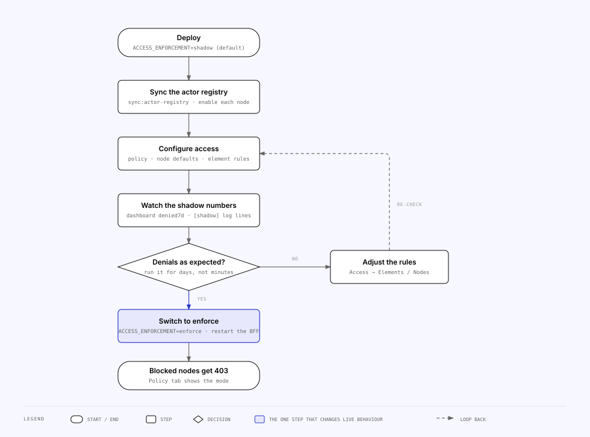

<!-- Generated from the MILS Bridge source repository (docs/operations/runbooks.md). Edit it there, not here. -->

# Runbooks

The operational scripts under `apps/api/scripts/` and the procedures that use
them. Every script is a `ts-node` entry point wired in `apps/api/package.json`,
run as `pnpm --filter @bridge/api <name> [-- --flag …]` (the `--` forwards flags
past pnpm); each loads `apps/api/.env` / `.env.local` through
`apps/api/scripts/load-env.ts` and talks to the same SQLite store and upstreams as the
running BFF, so they work against a deployed volume as well as `dev.db`.

## Scripts

| Script                       | When to run                                                                                                                                                                                                                                                                                                                                                                                                                                                                                                                                                                                          | Flags                                                                                                                                        | Dry-run                                                                         | Never does                                                                                                                                                                                                                                                                                                                                                                                                                                                                                                                                                                |
| ---------------------------- | ---------------------------------------------------------------------------------------------------------------------------------------------------------------------------------------------------------------------------------------------------------------------------------------------------------------------------------------------------------------------------------------------------------------------------------------------------------------------------------------------------------------------------------------------------------------------------------------------------- | -------------------------------------------------------------------------------------------------------------------------------------------- | ------------------------------------------------------------------------------- | ------------------------------------------------------------------------------------------------------------------------------------------------------------------------------------------------------------------------------------------------------------------------------------------------------------------------------------------------------------------------------------------------------------------------------------------------------------------------------------------------------------------------------------------------------------------------- |
| `register:concore-item`      | Register one Concore entity by hand (no console)                                                                                                                                                                                                                                                                                                                                                                                                                                                                                                                                                     | `--kind=<CONCORE_KINDS>` `--id=<uuid>` `--object={milsObjectId}` `--itemType={milsItemTypeId}`                                               | no                                                                              | Skip the mapping/log write — same path as the console                                                                                                                                                                                                                                                                                                                                                                                                                                                                                                                     |
| `import:concore-catalog`     | Bulk backfill a Concore catalog into MILS, resumable                                                                                                                                                                                                                                                                                                                                                                                                                                                                                                                                                 | `--kind=…` `--object=…` `--itemType=…` `[--limit=100]` `[--max=1000]`                                                                        | yes — without `--object`/`--itemType` it lists and counts only                  | Re-register an already mapped entity; it advances the per-kind `SyncCursor` so a re-run resumes                                                                                                                                                                                                                                                                                                                                                                                                                                                                           |
| `mapping:lookup`             | Resolve one mapping from either side                                                                                                                                                                                                                                                                                                                                                                                                                                                                                                                                                                 | `--milsId={…}` **or** `--concoreId=<uuid> --kind=…`                                                                                          | read-only                                                                       | —                                                                                                                                                                                                                                                                                                                                                                                                                                                                                                                                                                         |
| `mapping:export`             | Dump the mapping table                                                                                                                                                                                                                                                                                                                                                                                                                                                                                                                                                                               | `--out=mappings.csv`                                                                                                                         | read-only                                                                       | —                                                                                                                                                                                                                                                                                                                                                                                                                                                                                                                                                                         |
| `reconcile`                  | Verify every `REGISTERED` mapping still resolves on both ends                                                                                                                                                                                                                                                                                                                                                                                                                                                                                                                                        | —                                                                                                                                            | read-only, reports drift                                                        | Mutate a mapping. Concore rows are checked against Concore, `google-drive-file` rows against the **local store** (not Drive), `api-exchange` rows against the `ApiExchange` row                                                                                                                                                                                                                                                                                                                                                                                           |
| `backfill:item-payloads`     | After upgrading past the point where registration started writing payloads; also for `api-exchange` rows. With `--refresh-descriptors`: rewrite the `internalContentPath` of Google Drive descriptors written before 2026-09-03 with the retired `/rest/api/mils-internal` prefix                                                                                                                                                                                                                                                                                                                    | `[--refresh-descriptors [--apply]]`                                                                                                          | n/a (create-if-missing); `--refresh-descriptors` is a dry run without `--apply` | Overwrite an existing `MilsItemPayload` row (possibly curated in the console) — `--refresh-descriptors` changes exactly one field, only in rows that are a stored-file descriptor carrying the retired prefix                                                                                                                                                                                                                                                                                                                                                             |
| `load:signing-key`           | Put the MILS RS256 private key (+ passphrase) into the settings row from a file                                                                                                                                                                                                                                                                                                                                                                                                                                                                                                                      | `--key=<pem path>` `[--passphrase=…]` or env `MILS_KEY_PASSPHRASE`                                                                           | no                                                                              | Print the key. An encrypted PKCS#8 PEM needs the passphrase                                                                                                                                                                                                                                                                                                                                                                                                                                                                                                               |
| `encrypt:secrets`            | After setting `SECRETS_KEY`, to encrypt what is already stored; with `--rotate` to move onto a new key                                                                                                                                                                                                                                                                                                                                                                                                                                                                                               | `[--dry-run]` `[--rotate]` (rotation also needs `SECRETS_KEY_OLD`)                                                                           | **yes** via `--dry-run`                                                         | Touch a value that is already encrypted, unless `--rotate`. Idempotent and resumable — re-run an interrupted migration                                                                                                                                                                                                                                                                                                                                                                                                                                                    |
| `user:reset-password`        | Break-glass for a lost admin password (the in-app reset needs another active admin)                                                                                                                                                                                                                                                                                                                                                                                                                                                                                                                  | `--email=<console user>`                                                                                                                     | no                                                                              | Keep old sessions — it prints a one-time temporary password, forces a change on next login, clears any lockout and revokes the user's sessions                                                                                                                                                                                                                                                                                                                                                                                                                            |
| `sync:actor-registry`        | Pull MILS `/Actors` into `ActorRegistration` **and** `/Nodes` into `NodeRegistration`, outside the console                                                                                                                                                                                                                                                                                                                                                                                                                                                                                           | —                                                                                                                                            | no                                                                              | Enable anything. New rows are created **disabled** (fail closed); existing `enabled` flags are preserved; actors without a usable certificate or issuer, and nodes without an id or owner actor, are skipped and counted                                                                                                                                                                                                                                                                                                                                                  |
| `mint:node-token`            | Exercise the node-authenticated surface locally without a real peer                                                                                                                                                                                                                                                                                                                                                                                                                                                                                                                                  | `[--style sub-code\|node\|sub-node\|sub-actor]` `[--node <uuid>]` `[--ttl <s>]` `[--aud …]` `[--rotate]`                                     | no                                                                              | Run in production (it refuses). It writes a **fake** actor + node into the local registry and prints a token signed by a throwaway key. Defaults to the MILS convention (`sub` = ActorCode, `aud` = **our own** `<our code>-mils-api` — the audience names the recipient — and no node claim), so what you exercise locally is what a real peer sends                                                                                                                                                                                                                     |
| `files:verify`               | After a volume restore or when `410 Gone` appears on file content                                                                                                                                                                                                                                                                                                                                                                                                                                                                                                                                    | `[--hash]` re-hashes every blob against its sha256 key                                                                                       | read-only, non-zero exit on drift                                               | —                                                                                                                                                                                                                                                                                                                                                                                                                                                                                                                                                                         |
| `files:gc`                   | Reclaim blobs left by failed registrations or superseded by a re-sync                                                                                                                                                                                                                                                                                                                                                                                                                                                                                                                                | `[--apply]`                                                                                                                                  | **yes by default**                                                              | Delete a blob some `StoredFile` row still references                                                                                                                                                                                                                                                                                                                                                                                                                                                                                                                      |
| `api-explorer:prune`         | Trim the API Explorer request log below the automatic retention                                                                                                                                                                                                                                                                                                                                                                                                                                                                                                                                      | `[--apply]` `[--keep N]` (default `API_EXPLORER_RETENTION_PER_API`) `[--api <id>]`                                                           | **yes by default**                                                              | Delete an exchange a mapping points at                                                                                                                                                                                                                                                                                                                                                                                                                                                                                                                                    |
| `backfill:mils-object-ids`   | Ask MILS what each registered item **is** — its `ObjectId` and its `ItemTypeId` — and store both on the mapping. Needed for rows registered before `ResourceMapping.milsObjectId` / `itemTypeId` existed: the inbound permission handshake resolves an object to its elements through the first, and `GET /rest/MilsItems` requires the second as a filter, so **until this has run the list answers nothing for historical rows**                                                                                                                                                                   | `--apply` (dry by default)                                                                                                                   | n/a                                                                             | Never overwrites a value that is already there, per column: a row missing only one of the two gets only that one written. One `GET /Items/{id}` per row; the two counts are reported separately                                                                                                                                                                                                                                                                                                                                                                           |
| `backfill:mils-root-objects` | Fill in `ResourceMapping.milsRootObjectId` — the **root** of the MILS object tree above each element — by climbing `ObjectParentId`. The network grants access at root level, so a handshake about a site is answered by folding every element in that site's subtree; an element with no root recorded is invisible to a root-level grant (it is still found by its exact object, so nothing breaks — the peer is just told there is nothing of theirs under that site). Run it after `backfill:mils-object-ids`, and whenever MILS starts publishing sub-objects under an object you register into | `--apply` (dry by default)                                                                                                                   | n/a                                                                             | Never overwrites a root that is already there. Rows whose `milsObjectId` is null are skipped and counted — there is nothing to climb from. A row whose climb cannot finish (MILS unreachable, a 404 mid-chain, a cycle, the 32-level cap) is **left null and listed with the reason**: null means "unknown", never "it is its own root", so re-running once MILS answers is safe and correct. One chain is walked once per run however many elements sit under it                                                                                                         |
| `backfill:mapping-owners`    | Give Google Drive elements registered before `ResourceMapping.ownerUserId` existed back to the person who registered them, read from `StoredFile.registeredByUserId` — an unowned Drive mapping is ADMIN-only to re-sync or archive                                                                                                                                                                                                                                                                                                                                                                  | `--apply` (dry by default)                                                                                                                   | n/a                                                                             | Never overwrites an owner that is already set, and never guesses: a row with no stored file, or one a CLI registered, is left unowned and listed                                                                                                                                                                                                                                                                                                                                                                                                                          |
| `peer:diagnose`              | A peer cannot be reached or refuses us, and the console is not the place to look (or cannot be reached)                                                                                                                                                                                                                                                                                                                                                                                                                                                                                              | `--node <NodeId\|name>`, `--item <ItemId>` or `--object <ObjectId>`; `[--ask]` `[--read]` `[--continue]` `[--curl]` `[--json]` `[--verbose]` | read-only unless `--ask` (files the handshake) / `--read`                       | Accept a URL — the target comes from the registry. Skip the guard, the handshake, or `PEER_FEDERATION`: `--ask` and `--read` refuse when it is not `on`. Every call is recorded like a console click (`triggeredBy: cli`). Walks registry → URL → guard → an **anonymous** GET (dns/tcp/tls under it) → the authenticated probe → the stored grant; `--item` also prints the **object** the handshake would ask about, and `--object` walks every node MILS says owns an item under one; `--curl` prints each GET as the cURL the console offers, bearer as a placeholder |
| `peer:self-check`            | Before contacting a peer's operator: would a peer that synced MILS accept a token from _this_ node?                                                                                                                                                                                                                                                                                                                                                                                                                                                                                                  | `[--probe]` (loopback of our own URL) `[--token --for <NodeId\|name\|mils>]` `[--ttl <s>]` `[--json]`                                        | read-only unless `--probe` (one call to ourselves) / `--token`                  | Call a peer. `--token` mints a real, short-lived credential addressed to one recipient and audits it — treat the output as one                                                                                                                                                                                                                                                                                                                                                                                                                                            |
| `inspect:token`              | The ADMIN token inspector from a shell                                                                                                                                                                                                                                                                                                                                                                                                                                                                                                                                                               | `--token <jwt> [--node-header <NodeId>]` or `--event <id>` or `--recent [--limit N]`                                                         | read-only                                                                       | Store the token. `--recent` lists refused tokens from the rejection log so one can be re-run with `--event` without asking the peer for it                                                                                                                                                                                                                                                                                                                                                                                                                                |

Database housekeeping goes through Prisma: `prisma:migrate` (create/apply a dev
migration), `prisma:deploy` (apply pending migrations — what the containers and
the desktop run at start), `prisma:studio` (inspect the store), `prisma:seed`
(idempotent: the singleton `AccessPolicy` row and one `SyncCursor` per Concore
kind — `apps/api/prisma/seed.ts`), `db:reset` (drop + re-migrate + seed; dev
only).

## Procedures

### Roll out access enforcement (shadow to enforce)

Rules nothing consults are a UI with no effect, but turning enforcement on
blind would lock live nodes out. The default `shadow` mode records every
decision on the request metric and lets every request through, so the numbers
can be watched first.

1. Deploy with `ACCESS_ENFORCEMENT` unset or `shadow`.
2. Sync the actor registry (console, or `sync:actor-registry`) and **enable**
   each node that should be allowed to connect — they start disabled.
3. Set the global policy, per-node defaults and per-element rules under
   `/access`. Every write needs an `ADMIN` session.
4. Watch the dashboard's 7-day **denied** count and the BFF log: a would-be
   denial is logged as `[shadow] would block <actor> from element <id>` at most
   once per node + element per hour (`apps/api/src/access/element-access.guard.ts`),
   so shadow can run for weeks without flooding. _Access → Statistics_ does not
   show denials — it covers the unauthenticated mils-internal surface, where no
   decision is made.
5. When the denials are the ones you expect, set `ACCESS_ENFORCEMENT=enforce`
   and restart the BFF. Blocked nodes now receive
   `403 Access to this element is blocked by policy.` on the element reads
   (`mappings/:id`, `mappings/lookup`, `item-payloads/:milsId`,
   `files/:milsId[/content]`). The Policy tab shows the active mode.

Enforcement never touches console sessions, list routes, writes, the two
upstream proxies or `/rest/*` — details in
[`access-control.md`](access-control.md).

### Bring up a new deployment

1. Start the stack ([`deployment.md`](deployment.md)); migrations run on start.
2. Open the console → `/setup` creates the first `ADMIN` user.
3. On `/integrations/mils` paste the base URL and the RS256 signing key (or run
   `load:signing-key`), _Save & test_; on `/integrations/concore` the base URL,
   API key and organisation id, _Save & test_.
4. Sync the actor registry and enable the nodes that may connect.
5. Leave `ACCESS_ENFORCEMENT` on `shadow`; follow the rollout above.

### Restore or move the store

Everything stateful is `mapping.db` plus the file-store directory (the
`mapping-data` volume in Docker, `%APPDATA%/Concore-MILS Bridge/` on the
desktop). After restoring: `prisma:deploy` runs on start; then `files:verify`
(add `--hash` if the blobs' integrity is in doubt) and `reconcile`. A row whose
blob is missing serves `410 Gone` until _Re-sync from Drive_ in the console
restores it.

### Reclaim disk

`files:gc` lists orphan blobs; `files:gc -- --apply` deletes them.
`api-explorer:prune` lists what a lower retention would remove;
`-- --apply` deletes it. Mapped rows survive both. Request metrics prune
themselves after 31 days, at most once an hour
(`apps/api/src/metrics/request-metrics.store.ts`); expired sessions are pruned
lazily by `apps/api/src/auth/session.service.ts`. Neither needs a script.

### A peer node cannot authenticate

The peer sees one uniform `401 Invalid actor token.` whatever went wrong — that
is deliberate, so a caller cannot probe which nodes and actors exist here, and
it means the peer's operator cannot diagnose it either. **You can, without
asking them for anything**: every refusal is kept on this side, with the request
around it.

1. Open **Access → Nodes**. The node's row shows _refused 2 min ago_ beside its
   last-seen time when the ladder could attribute the token to it; its
   **Diagnostics → What they sent** lists each refused token with the reason,
   the route, the remote address, the `X-MILS-Node-Id` header and the decoded
   claims, and a **Re-run the ladder** button that re-derives the resolution
   and the expected `aud` / `iss` / `sub` from the stored claims against the
   registry as it is now. Tokens the ladder could not pin to any node are under
   **Refused tokens from unknown callers** (ADMIN). From a shell:
   `pnpm --filter @bridge/api inspect:token -- --recent`, then
   `--event <id>`. The same facts are on one `warn` line in the API log:
   `Peer token rejected on GET /rest/… from 203.0.113.9
X-MILS-Node-Id=… sha256:…: <reason> [sub=… iss=… aud=… exp=… kid=…]`.
2. Only the **signature** cannot be re-checked from a stored rejection — the
   token itself is never kept. If the recorded reason is a signature failure
   and the claims all match, ask them for the token (it is a bearer credential,
   so treat it as one) and paste it into **Diagnose a token**, or
   `POST /api/integration/node-registry/inspect-token` with `{ "token": "…" }`.
   The answer names the ladder step, the rows it selected, whether the
   signature verified, and whether the _current_ `MILS_INTERNAL_AUTH` would
   accept it, with `aud` / `iss` / `sub` **expected beside actual**.
3. Read it against the usual causes:

| What the inspector says                         | Fix                                                                                                                                                                                                                                                                                                                               |
| ----------------------------------------------- | --------------------------------------------------------------------------------------------------------------------------------------------------------------------------------------------------------------------------------------------------------------------------------------------------------------------------------- |
| `unknown node` / `no registered node or actor`  | Sync the registry — MILS knows the peer, this bridge has not pulled it yet                                                                                                                                                                                                                                                        |
| The actor never appears, however often you sync | MILS may publish it in an `ActorState` outside `ACTOR_STATE_SWEEP`. The actor list is the union of one `/Actors?FilterActorState=` read per swept value, because MILS refuses an unfiltered `/Actors`; check with `GET /Actors?FilterText=<their code>` and extend the sweep in `actor-registry.service.ts`                       |
| `node … is disabled` / `actor … is disabled`    | Enable it on _Access → Nodes_. Both switches apply: the actor holds the key, the node is the caller                                                                                                                                                                                                                               |
| `no registered owner actor`                     | MILS has no usable certificate or issuer for that node's owner actor. Fix it in MILS, then sync                                                                                                                                                                                                                                   |
| `iss` differs only by a trailing slash          | Issuer drift. `https://mils.example/` and `https://mils.example` are different issuers and give identical 401s — the inspector's expected-vs-actual rows are what make it visible. Fix the peer's `iss`, or the actor's `ActorTokenIssuer` in MILS                                                                                |
| `sub` differs only in case, or is missing       | The convention puts the actor's `ActorCode` in `sub`. Case and braces are folded away, so a mismatch here is a genuinely different code — or a peer still minting `sub` as an id                                                                                                                                                  |
| `matches N actor codes`                         | Two actors share an `ActorCode`, so **both** are locked out. Give them distinct codes in MILS and re-sync, or have the peer name its node with `X-MILS-Node-Id`                                                                                                                                                                   |
| `aud` is **theirs** — e.g. `blm-rest-api`       | **The first suspect for a peer that used to work.** `aud` names the recipient, so a conforming token addressed to us carries one of _our_ names (`conc-rest-api`, `conc-mils-api`); a peer stamping its own is reading the audience as naming the sender. Have it stamp a value the inspector shows (also readable from `whoami`) |
| `aud` is a third actor's                        | The peer's token does not agree with its own `sub`. It is minting under an identity it is not authenticating as — their fix, not ours                                                                                                                                                                                             |
| `aud` absent                                    | A peer that predates the convention sends none. Fix the peer, or set `MILS_TOKEN_AUDIENCE=` (defined, empty) to skip the check                                                                                                                                                                                                    |
| The expected `aud` says `[PINNED]`              | **This node pins the accepted list** with `MILS_TOKEN_AUDIENCE`, replacing our own names, so a peer addressing us by any other gets the same 401. Unset it to accept `<our code>-rest-api` and `<our code>-mils-api`; the boot log warns about this                                                                               |
| signature invalid                               | The peer is signing with a key whose certificate MILS no longer publishes — re-sync, then have them rotate                                                                                                                                                                                                                        |
| `owns N enabled nodes and the token names none` | Expected for a conventional token: it names no node and binds to one only when its actor owns exactly one enabled node. Have the peer send its `NodeId` as the `X-MILS-Node-Id` header (or a `node` claim)                                                                                                                        |
| Accepted, but the peer still gets `401`         | Check the surface it calls is the one you checked — the inspector answers for `mils-internal` under the _current_ `MILS_INTERNAL_AUTH`                                                                                                                                                                                            |

The server log carries the same sentence at `warn` for every refusal, with the
request around it, if you would rather read it there than open the console.

### Recover a locked-out administrator

`user:reset-password -- --email=<address>` prints a temporary password once,
revokes that user's sessions and forces a change at next login. Requires
access to the host (the `.env` / `DATABASE_URL` of the deployment).

### Backfill payloads after an upgrade

Mappings registered before registration wrote `MilsItemPayload` rows serve
nothing on the mils-internal `ItemData` endpoint. `backfill:item-payloads`
creates the missing rows from `ResourceMapping.concoreSnapshot` and leaves
existing rows alone; run it once, any time.

**A Drive file's `ItemData` names a path that 404s.** Descriptors written before
2026-09-03 carry `internalContentPath: /rest/api/mils-internal/MilsItems/…`, the
prefix this node no longer serves. `backfill:item-payloads --refresh-descriptors`
lists the rows that carry it; add `--apply` to rewrite that one field to
`/rest/MilsItems/…`. Nothing else in the row changes, and a row that merely
mentions the old prefix without being a descriptor is skipped and counted.
Re-syncing a single file from the console does the same for that file.

### A peer read fails

Federated reads report a typed **outcome** rather than an HTTP error, and the
outcome names the side that failed. Most rows here resolve on the _other_ node;
the pending and denied rows resolve in _their_ _Access → Elements_.

**Start with the self-check.** _Access → Nodes → This node_ (or
`pnpm --filter @bridge/api peer:self-check`) answers, without calling anyone,
whether a peer that synced MILS would accept a token from this node: our signing
key against the certificate MILS publishes for our actor (both SPKI fingerprints
are named on a mismatch), our `iss` / `sub` / `aud` against the published issuer
and code, a fresh token through the very verifier a peer runs, the certificate's
expiry, and our own node row. A `REFUSED` from every peer with a red finding
here is our problem, not theirs. _Probe ourselves_ (ADMIN) then proves the
reverse proxy forwards `/rest` from our public host name.

**Then read the exchange.** Every probe result opens to the exchange behind it,
the item panel's **What happened** lists every request this node made about the
item (handshake legs and reads, newest action first), and each shows the
request line, our token's decoded claims, the redacted headers, the DNS answer,
the TCP endpoint, the TLS certificate the peer presented, per-phase timings, the
response headers and the first bytes of the body — and, for the handshake
POST, the body we sent, with a **cURL** of the request to copy (the bearer a
placeholder; an ADMIN can copy it with a fresh token). `peer:diagnose --node <name>`
prints the same walk from a shell, with an **anonymous** GET first: a `401` JSON
there proves a guarded MILS-internal API is at that URL, a `404` JSON an open
one, HTML a proxy — before any credential is spent.

The panel is on the MILS item page (`/items/$id`), under the item's own fields.
No panel at all means `PEER_FEDERATION` is unset on this deployment — the routes
do not exist, so the console shows one muted sentence naming the flag.

| Outcome              | Whose problem   | What to do                                                                                                                                                                                                                                                                                                                                                                                                                                                                                                                                                                                                                                                                                                                       |
| -------------------- | --------------- | -------------------------------------------------------------------------------------------------------------------------------------------------------------------------------------------------------------------------------------------------------------------------------------------------------------------------------------------------------------------------------------------------------------------------------------------------------------------------------------------------------------------------------------------------------------------------------------------------------------------------------------------------------------------------------------------------------------------------------- |
| `LOCAL`              | nobody          | The item is this node's own — its payload is on the page already, in the other panel. Set the own-node id in _Settings → MILS_ to make that an exact answer rather than an actor-code inference                                                                                                                                                                                                                                                                                                                                                                                                                                                                                                                                  |
| `UNKNOWN_ITEM`       | MILS            | MILS has no item with that id                                                                                                                                                                                                                                                                                                                                                                                                                                                                                                                                                                                                                                                                                                    |
| `UNREGISTERED_NODE`  | **us**          | Sync the node registry (_Access → Nodes_). The registry is the allow-list; an unsynced owner is not a target                                                                                                                                                                                                                                                                                                                                                                                                                                                                                                                                                                                                                     |
| `NODE_DISABLED`      | **us**          | Enable the peer, or its owner actor, in _Access → Nodes_. That switch cuts both ways                                                                                                                                                                                                                                                                                                                                                                                                                                                                                                                                                                                                                                             |
| `NO_HOST`            | MILS            | MILS publishes no usable `NodeHostName` for that node. Fix it in MILS, then sync                                                                                                                                                                                                                                                                                                                                                                                                                                                                                                                                                                                                                                                 |
| `NO_KEY`             | **us**          | No signing key configured — _Settings → MILS_. Without one this node cannot introduce itself to anyone                                                                                                                                                                                                                                                                                                                                                                                                                                                                                                                                                                                                                           |
| `INSECURE_TARGET`    | MILS / policy   | The peer's host is `http://` or a private address this deployment blocks. Fix the host name in MILS, or set `PEER_ALLOW_PRIVATE_TARGETS` for a development peer                                                                                                                                                                                                                                                                                                                                                                                                                                                                                                                                                                  |
| `ACCESS_PENDING`     | **the peer**    | Not a fault: they have not granted yet. _Check again_ later. The raw `ObjectAccessState` is on screen — if the network uses a different convention, set `PEER_ACCESS_GRANTED_STATES`                                                                                                                                                                                                                                                                                                                                                                                                                                                                                                                                             |
| `ACCESS_DENIED`      | **the peer**    | They know exactly who this node is and said no. Ask their operator to allow the element for this node (their _Access → Elements_), then _Ask again_                                                                                                                                                                                                                                                                                                                                                                                                                                                                                                                                                                              |
| `ACCESS_UNSUPPORTED` | **the peer**    | They serve no `MilsObjectAccesses` handshake, so no permission can be asked for — and nothing is read. Their fix; there is no setting here that reads without asking                                                                                                                                                                                                                                                                                                                                                                                                                                                                                                                                                             |
| `REFUSED`            | **the peer**    | HTTP 401/403 — they do not know who we are, or we addressed them by the wrong name. **Read the sentence first**: a peer that names the audience it validates (`IDX10214 … ValidAudience`) has told you the fix — store that value as the node's audience override (_Access → Nodes_, Edit audience) and probe again; the console never stores it for you. Otherwise run the self-check; if it is green, **Hand over a token** (_This node_, ADMIN, pick that peer; or `peer:self-check --token --for <node>`) mints a five-minute token addressed to that peer for its operator to paste into their inspector. The exchange's body excerpt says whether a bridge answered (`"Invalid actor token."`) or something in front of it |
| `NOT_FOUND`          | **the peer**    | HTTP 404 — they granted access but have no item data stored for that item                                                                                                                                                                                                                                                                                                                                                                                                                                                                                                                                                                                                                                                        |
| `NOT_MILS_INTERNAL`  | the peer's host | Something answered on that host, but not a MILS-internal API — the sentence now says **what**: a reverse proxy (by its `server` header or a Basic challenge), an HTML page, or something unrecognised, with the first bytes of the body. Check their host name and that they route `/rest`                                                                                                                                                                                                                                                                                                                                                                                                                                       |
| `UNREACHABLE`        | the network     | The sentence names the **phase**: `[DNS]` the host name does not resolve from this node; `[CONNECT]` the port answered but nothing listens (their proxy is not forwarding the path, or the port in `NodeHostName` is wrong) or no route (a firewall); `[TLS]` their certificate was refused — subject, issuer and expiry are named, and TLS is never relaxed here (a dev peer uses `http://` under `PEER_ALLOW_PRIVATE_TARGETS`); `[TIMEOUT]` nothing within `PEER_FETCH_TIMEOUT_MS`, with the phase reached; `[RESET]` the connection closed mid-exchange; `[REDIRECT]` a 3xx, never followed                                                                                                                                   |
| `TOO_LARGE`          | policy          | Their answer exceeds `PEER_DATA_MAX_BYTES` / `PEER_FILE_MAX_BYTES`                                                                                                                                                                                                                                                                                                                                                                                                                                                                                                                                                                                                                                                               |

The distinction worth internalising is `REFUSED` versus `ACCESS_DENIED`: the
first means the peer does not know who we are (an authentication problem, fixed
on their registry), the second that it knows exactly who we are and said no (an
authorization decision, fixed in their access rules). They look identical from
the outside and have nothing in common as fixes — which is why asking is a
separate leg from reading.

### Answering a peer that says our node is pending forever

Check the inbound side. `POST /MilsObjectAccesses` answers with this node's own
`resolveAccess` decision, so a peer stuck at pending means we recorded `0` —
which happens when the request had **no principal**: under
`MILS_INTERNAL_AUTH=open` or `actor` the write carries no node, so there is
nobody to decide about. Set `MILS_INTERNAL_AUTH=node` and make sure the peer's
actor and node are synced and enabled here; then the answer comes from
_Access → Elements_ for that node.

Note the `shadow` asymmetry while you are there: with
`ACCESS_ENFORCEMENT=shadow` this node will **grant** a request and then serve the
payload it would otherwise have blocked, because the grant is a published
decision and the item read is the enforced one. That is what `shadow` means.

## Related

- [`configuration.md`](configuration.md) — the env the scripts read.
- [`troubleshooting.md`](troubleshooting.md) — symptom → script.
- [`access-control.md`](access-control.md) — what enforcement decides, and the grant it now also answers.
- [`actors-and-nodes.md`](actors-and-nodes.md) — federated reads end to end, and the switches that gate one.
