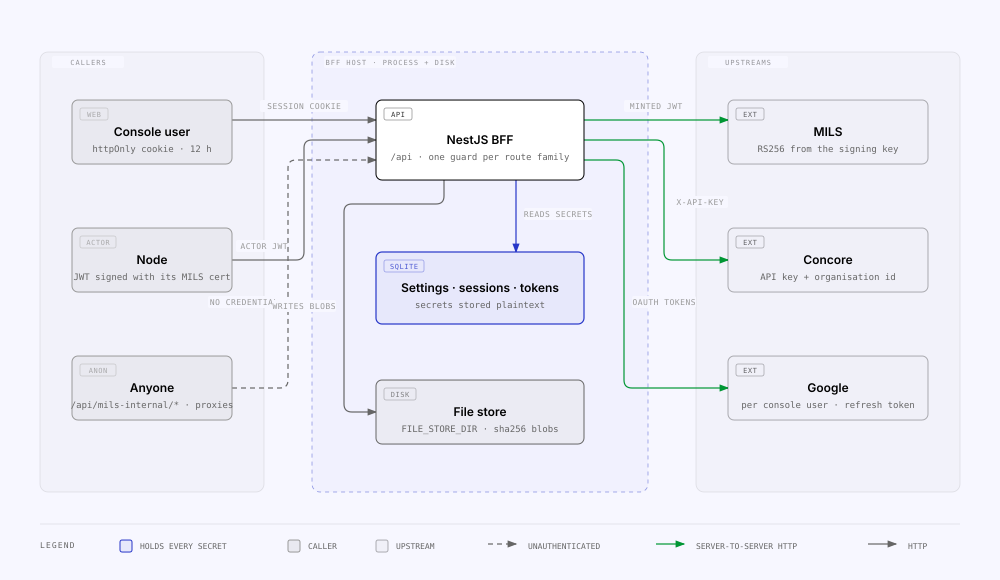

<!-- Generated from the MILS Bridge source repository (docs/operations/security.md). Edit it there, not here. -->

# Security

What the BFF protects, what it deliberately leaves open, and where the secrets
end up. The one design decision everything else follows from: the browser holds
**no upstream credential** and makes **no cross-origin call** — every secret
lives on the BFF host and every upstream call is server-to-server.

## Trust zones



| Edge               | Credential that crosses it                                                            | Where it is checked                                                              |
| ------------------ | ------------------------------------------------------------------------------------- | -------------------------------------------------------------------------------- |
| Console → BFF      | Session cookie (`bridge.sid`, httpOnly, `sameSite=lax`, `secure` in production)       | `AuthGuard` (`apps/api/src/auth/auth.guard.ts`), `RolesGuard` for `ADMIN` routes |
| Node → BFF         | Actor JWT, verified against the actor's certificate from the MILS registry            | `ActorAuthGuard`, `IntegrationAuthGuard` (`apps/api/src/actor-registry/`)        |
| Anyone → BFF       | Nothing                                                                               | See [unauthenticated surfaces](#unauthenticated-surfaces)                        |
| BFF → MILS         | RS256 JWT minted from the stored signing key (else `MILS_JWT`, else forwarded header) | `apps/api/src/mils/mils.client.ts`                                               |
| BFF → Concore      | `X-API-Key` + `X-Organization-Id` (else env bearer)                                   | `SettingsService.concoreAuth()`                                                  |
| BFF → Google       | Per-console-user OAuth access/refresh tokens                                          | `apps/api/src/google-drive/google-account.service.ts`                            |
| BFF → imported API | The API's stored credential, injected by the proxy                                    | `apps/api/src/api-explorer/api-explorer-proxy.service.ts`                        |

CORS is scoped to the `WEB_ORIGIN` allow-list with `credentials: true` — never
a wildcard with credentials (`apps/api/src/main.ts`).

## Guards per route family

| Route family                                                                                         | Guard                                                                                                                            | Who can call                                                                                                    |
| ---------------------------------------------------------------------------------------------------- | -------------------------------------------------------------------------------------------------------------------------------- | --------------------------------------------------------------------------------------------------------------- |
| `/api/mils/*`, `/api/concore/*`                                                                      | `AuthGuard` (session)                                                                                                            | console users — the proxies forward verbatim and inject the BFF's own upstream credential, so they are not open |
| `/rest/*`                                                                                            | none (`ElementRefGuard` attributes, never decides)                                                                               | anyone                                                                                                          |
| `/api/health/*`, `/api/version`, `/api/docs`, `/api/integration/docs`                                | none                                                                                                                             | anyone                                                                                                          |
| `/api/auth/*`                                                                                        | none for login/setup; session for the rest                                                                                       | —                                                                                                               |
| `/api/integration/mappings`, `…/registrations`, `…/item-payloads`, `…/files`                         | `IntegrationAuthGuard` (session **or** actor JWT), + `ElementAccessGuard` on element reads and `ElementWriteGuard` on the writes | console users and nodes — the public integration API (`PUBLIC_INTEGRATION_PREFIXES` in `main.ts`)               |
| `/api/actor-registry/whoami`                                                                         | `ActorAuthGuard`                                                                                                                 | nodes                                                                                                           |
| `/api/integration/settings`, `…/integrations`                                                        | `AuthGuard` (+ `RolesGuard` on the writes)                                                                                       | reads and connection tests: any console user; settings writes: `ADMIN`                                          |
| `/api/integration/google-drive`, `…/api-explorer`, `…/audit`, `…/stats`, `…/dashboard`, `…/activity` | `AuthGuard`                                                                                                                      | any signed-in console user                                                                                      |
| `/api/integration/access/*`, `…/actor-registry`, `/api/users`                                        | `AuthGuard` + `RolesGuard`                                                                                                       | reads: any console user; writes: `ADMIN`                                                                        |

The public OpenAPI document at `/api/integration/docs` is built from an explicit
module allow-list and then pruned to `PUBLIC_INTEGRATION_PREFIXES`, so an
internal route added to one of those modules cannot leak into the externally
published spec.

### Writes on the dual surface

Reads and writes on `/api/integration/*` are guarded differently, and the
difference is the point:

|                                       | Read (`ElementAccessGuard`)                  | Write (`ElementWriteGuard`)                        |
| ------------------------------------- | -------------------------------------------- | -------------------------------------------------- |
| Console session                       | allowed, no decision recorded                | allowed, no decision recorded                      |
| Actor, `INTEGRATION_ACTOR_WRITES=off` | subject to the access decision               | **403** — this node accepts no actor writes        |
| Actor, route resolves to no element   | allowed (it is a list read)                  | **403** — a write must target a registered element |
| Actor, element resolves to `BLOCK`    | 403 under `enforce`, recorded under `shadow` | same                                               |

The unresolved-element rule is checked independently of `ACCESS_ENFORCEMENT`:
it is structural, not a policy decision, so turning enforcement off must not
reopen the ability to write to an unregistered MILS id. The policy itself is
two pure functions in `apps/api/src/access/write-policy.ts`, tested in
`apps/api/test/write-policy.test.ts`.

`POST /api/integration/registrations` creates a _new_ element, so it never
resolves to an existing one: it is console-only under the default, and refused
by the unresolved-element rule even when actor writes are enabled. That is
deliberate — asking this node to spend its MILS credential is a trust decision,
not a data read.

## Unauthenticated surfaces

| Surface                                                   | Why it is open                                                                                                                                                                                                   | What limits the exposure                                                                                                                                                                                                                                                          |
| --------------------------------------------------------- | ---------------------------------------------------------------------------------------------------------------------------------------------------------------------------------------------------------------- | --------------------------------------------------------------------------------------------------------------------------------------------------------------------------------------------------------------------------------------------------------------------------------- |
| `/rest/*` (with `MILS_INTERNAL_AUTH=open`, the default)   | The BLM contract has no identity in it: requiring a credential breaks conformance for peers that implement the spec as written. `ItemFile` streams raw file bytes and `ItemData` the stored payload without one. | Only registered elements are served; `ElementRefGuard` records which. **Set `MILS_INTERNAL_AUTH=actor`** to require a credential and apply the element rules, or **`node`** to also require the caller to be a registered MILS node and refuse the anonymous object-access write. |
| `/api/integration/peer/*` when `PEER_FEDERATION` is unset | Not open — **absent**. The module registers no controller, so these answer a router 404. Listed here so nobody reads the 404 as a missing route.                                                                 | n/a — the capability is not in the process.                                                                                                                                                                                                                                       |
| `/api/health/*`, `/api/version`, the Swagger UIs          | Operational.                                                                                                                                                                                                     | Health answers carry no data; the docs describe routes, not credentials.                                                                                                                                                                                                          |

## Secrets: where they live and how they are shown

| Secret                                   | Stored in                                                     | At rest         | On read                                                                | Written from                                |
| ---------------------------------------- | ------------------------------------------------------------- | --------------- | ---------------------------------------------------------------------- | ------------------------------------------- |
| MILS RS256 private key + passphrase      | `IntegrationSettings.signingKeyPem` / `.signingKeyPassphrase` | **plaintext**   | `hasSigningKey`, `hasSigningKeyPassphrase`, 16-hex SHA-256 fingerprint | MILS panel, `load:signing-key`              |
| Concore API key                          | `IntegrationSettings.concoreApiKey`                           | **plaintext**   | `hasConcoreApiKey`, fingerprint, `concoreUsesEnvBearer`                | Concore panel                               |
| Google OAuth client secret               | `IntegrationSettings.googleClientSecret`                      | **plaintext**   | `hasGoogleClientSecret`, fingerprint                                   | Google Drive panel                          |
| Google access + refresh tokens, per user | `GoogleAccount`                                               | **plaintext**   | never returned                                                         | OAuth callback                              |
| Imported API credential                  | `ApiIntegration.authSecret`                                   | **plaintext**   | fingerprint only (write-only field)                                    | API Explorer settings                       |
| Console passwords                        | `User`                                                        | argon2 hash     | never                                                                  | `/setup`, users page, `user:reset-password` |
| Session tokens                           | `Session`                                                     | row per session | never                                                                  | login                                       |

**Set `SECRETS_KEY` and the rows marked "plaintext" above are encrypted
instead** — AES-256-GCM, one envelope per value, `common/secret-box.ts`. It is
opt-in: unset, everything behaves as it did, so an upgrade needs no key.

|                                   | Without `SECRETS_KEY` | With it                                                                                        |
| --------------------------------- | --------------------- | ---------------------------------------------------------------------------------------------- |
| At rest                           | as typed              | `v1:<iv>:<ciphertext‖tag>`                                                                     |
| Existing rows                     | —                     | `pnpm --filter @bridge/api encrypt:secrets` (idempotent, resumable, `--dry-run` first)         |
| Rotation                          | —                     | `SECRETS_KEY=<new> SECRETS_KEY_OLD=<old> … encrypt:secrets --rotate`                           |
| A missing key afterwards          | —                     | **boot fails** with a named error, rather than serving a credential it cannot read             |
| Fingerprints shown in the console | over the value        | unchanged — taken over the decrypted value, so they stay stable across encryption and rotation |

A value with no version prefix is legacy plaintext and is read verbatim, so a
partially-migrated database keeps working; that is what makes the migration
resumable. The encryption is applied explicitly in `SettingsService`,
`GoogleAccountService` and `ApiIntegrationService` rather than in Prisma
middleware — invisible encryption under the ORM makes it impossible to tell at
a call site whether a value is ciphertext, and one missed write silently stores
plaintext that later reads accept without complaint.

Beyond that, the boundary still applies: the row is only readable on the BFF
host, `SettingsService.get()` never includes a value, and the audit trail
records **field names**, never values (`summarizeSettingsPatch`). Outgoing HTTP
logging (`apps/api/src/common/http-logging.ts`) omits auth headers and bodies.

## API Explorer: the proxy is not an open proxy

`TargetGuard` (`apps/api/src/api-explorer/target-guard.ts`) applies two checks
to every URL the BFF is asked to fetch — an OpenAPI document by URL, an API's
base URL, and each proxied target:

| Check              | Rule                                                                                                                                                                     | Failure                                                                         |
| ------------------ | ------------------------------------------------------------------------------------------------------------------------------------------------------------------------ | ------------------------------------------------------------------------------- |
| Well-formed        | Absolute `http(s)` URL, no embedded credentials                                                                                                                          | `400`                                                                           |
| Under the base URL | Same origin and path prefix as the API's base URL; `%2e` / `%2f` / `%5c` in the path are refused outright                                                                | `403 … is not under this API's base URL`                                        |
| Not private        | Hostname is not `localhost` / `.local` / `.internal` / `.home.arpa` / `.lan` and resolves to no loopback, RFC1918, CGNAT, link-local, ULA, multicast or reserved address | `403 … private or loopback address` unless `API_EXPLORER_ALLOW_PRIVATE_TARGETS` |

The base-URL rule is what keeps the stored credential from being sent anywhere
the API owner did not configure. DNS rebinding between the check and the request
is out of scope.

Other proxy properties: redirects are never followed (`maxRedirects: 0`), the
request body is capped by `API_EXPLORER_MAX_REQUEST_BYTES` (raw parser scoped to
the proxy path in `main.ts`), the upstream call times out at
`API_EXPLORER_UPSTREAM_TIMEOUT_MS`, and hop-by-hop / cookie headers are
stripped before forwarding.

### What the request log records

`apps/api/src/api-explorer/api-exchange.service.ts` redacts
`authorization`, `proxy-authorization`, `cookie`, `set-cookie`, the API's own
api-key header name and credential-looking query parameters to `«redacted»`,
and truncates bodies above `API_EXPLORER_CAPTURE_BODY_MAX_BYTES`. **Bodies are
otherwise recorded as typed** — a password typed into a login body in the
explorer ends up in the log, which every signed-in console user can read.
Capture therefore **defaults to off**: a new API opts into it, and both the
import wizard and the settings panel say what it records. Existing APIs keep
whatever they were set to.

Any signed-in console user can still create APIs and send requests through
them, unlike Settings, whose writes are now `ADMIN`. Add `RolesGuard` +
`@Roles('ADMIN')` to the write routes of
`apps/api/src/api-explorer/api-explorer.controller.ts` if outbound integrations
should be admin-only too.

### The item-data gap, and the switch that closes it

With `MILS_INTERNAL_AUTH=open` the access model does **not** cover the surface
peers read from: a node blocked from an element on
`/api/integration/item-payloads/:milsId` still reads the same bytes at
`/rest/MilsItems/:milsId/ItemData`. That is not a bug in the guard
— it is the BLM contract having no identity to decide on — but it means
`ACCESS_ENFORCEMENT=enforce` alone does not protect item data.

Two settings therefore belong together on a node that enforces:

```
ACCESS_ENFORCEMENT=enforce
MILS_INTERNAL_AUTH=actor      # or `node`
```

`open` remains the default so an upgrade changes nothing for conformant peers;
choosing `actor` or `node` trades contract conformance for confidentiality, and
is the deployment's call. See
[`mils-internal-api.md`](mils-internal-api.md).

### Which peer is calling — the identity chain

`actor` answers "a registered actor holds a valid key". `node` answers **which
peer**, and the difference matters once one actor owns several nodes: without
it, every read from them is attributed and (in Phase 5 terms) governed as one.

The chain uses only material MILS already publishes:

```
token ──names──> NodeRegistration ──ownerActorId──> ActorRegistration
                 (the caller)                        (issuer + certificate)
                                                            │
                                              verifies the signature
```

The property to hold on to: **the owner link comes from the registry, never
from the token.** A token that claims node N is verified against N's owner
actor's certificate, so a peer cannot claim to be a node it does not own — the
claim selects someone else's key and the signature fails. Widening how a peer
may _name_ itself (a node claim, the `X-MILS-Node-Id` header, `sub` as a node
id or an actor code) therefore grants nothing on its own.

What `node` mode adds beyond attribution:

| Control                       | Effect                                                                                                  |
| ----------------------------- | ------------------------------------------------------------------------------------------------------- |
| Per-node kill switch          | Revoke one peer without revoking every peer its owner actor speaks for. Fail closed: new nodes are off. |
| Anonymous object-access write | Refused — the first posture where an identity exists at that route                                      |
| Ambiguity                     | An actor owning several nodes and naming none is refused, never guessed                                 |

### The audience bounds replay across recipients — the TTL and the kill switches bound the rest

This section has said four different things, and the fourth is measured
(`mils-audience-evidence-report.md`
§2.3, §2.4): `aud` names the **recipient**, and each recipient names it its
own way — `mils-rest-api` for MILS, `blm-mils-api` for the peer `blm`. Every
token this node mints is addressed to one recipient, so a token a peer obtains
from us is useless against MILS or against any other node, and a token a peer
minted to call MILS is useless here. See
`mils-recipient-named-audience-plan.md`
for the correction — it closes the residual risk
`mils-token-convention-plan.md`
filed in its §10, which the previous reading had re-opened — and
[`actors-and-nodes.md`](actors-and-nodes.md) for the
convention in full.

What the audience check buys is worth stating precisely: that the token was
minted **for us** (one of our own names, `<our code>-rest-api` or
`<our code>-mils-api`). It says nothing about who minted it — the signature
against a certificate MILS publishes (never anything in the token) and the
pinned `iss` decide _who_; these decide _for how long_:

| Bound                       | How far it goes                                                                                                    |
| --------------------------- | ------------------------------------------------------------------------------------------------------------------ |
| `ACTOR_JWT_MAX_TTL_SECONDS` | Rejects a token whose `exp − iat` exceeds it. Default `0` (uncapped) — **the only lever that shortens the window** |
| Certificate expiry          | `certNotAfter` in the past is refused even with a valid signature                                                  |
| The two `enabled` switches  | Per actor and per node, effective immediately, and the only revocation there is                                    |

And what a caller may _read_ once authenticated is decided by the access model,
the `MilsObjectAccesses` handshake and `MILS_INTERNAL_AUTH` — not by a claim.

`MILS_TOKEN_AUDIENCE` **pins** the accepted list, replacing our own names: a
peer that addresses us by any other name gets a uniform 401, and there is a
boot warning saying so. A defined-but-empty value switches the check off
entirely.

One narrow carve-out, unmeasured: the tokens MILS itself has been observed
minting carry its own `mils-rest-api`, so a caller that resolved to the `mils`
actor is additionally allowed that value. It admits nothing to anyone else.

**A peer's error text is a hint, never an input.** A refusing peer may name the
audience it validates (`IDX10214 … ValidAudience: 'blm-mils-api'`). The probe
and the handshake show it beside what we sent so an operator can store it as
that node's override; the code never mints from it — a peer that could steer
which `aud` we mint could ask for `mils-rest-api` and replay our token against
MILS.

Residual, unchanged by this: there is still **no revocation channel** other than
the registry and no scheduler, so a stolen key is valid until an admin disables
the actor or the node, or MILS rotates the certificate and someone syncs.

When a peer cannot connect, the uniform `401` is deliberate and leaves nobody
included. Failing closed here means being wrong costs a read that does not
happen rather than a peer's refusal read as consent.

### What our signed token is exposed to

There is **one token per recipient**, and it carries that recipient's audience
— so a peer that turns out to be hostile holds a credential addressed to itself
alone, which no other node and not MILS will accept. What limits the exposure
otherwise is that peers are operator-curated (the node registry is the
allow-list; a peer with no derivable audience and no stored override is not
called at all), `https` is enforced, redirects are never followed, and
`PEER_FEDERATION` is off unless a deployment turned it on. A short
`jwtTtlSeconds` (Settings → MILS; 3600 by default) remains good hygiene rather
than the only bound it was under the sender-named reading.

### What the diagnostics keep, and what they never keep

The peer diagnostics (`plans/peer-network-observability-plan.md`) add two
tables and one disclosing action, each bounded on purpose:

- **`PeerExchange`** — one row per outbound peer call. The bearer never reaches
  it: `authorization` is stored as `Bearer sha256:<12 hex>` beside the token's
  **decoded claims** (base64 in every token we send anyway). Cookies are
  dropped, header values are capped at 512 bytes, and the body is an excerpt of
  a **text** answer only (`PEER_TRACE_BODY_MAX_BYTES`) — a payload stream is
  never excerpted, so a peer's `ItemData` is not copied into the trace; a 401
  envelope or a proxy's error page is. Newest 200 per node within 31 days;
  `PEER_TRACE=off` writes nothing.
- **`PeerAuthEvent`** — one row per **refused** inbound token, with the route
  pattern (never the raw URL), the remote address (`req.ip`, honouring
  `TRUST_PROXY`, and personal data in the GDPR sense — 31-day retention), the
  `X-MILS-Node-Id` header, the token digest and its claims, and the reason. The
  claims are those of an **unverified** token from a stranger: the console
  renders them as text, never as links, and the inspector run from a stored row
  says plainly that the signature was not re-checked. Accepted requests are not
  re-written — `RequestMetric` already holds them.
- **The hand-off token** (`POST …/node-registry/self/token`, `peer:self-check
--token`) is a real credential any node in the network accepts from us. It is
  ADMIN-only, rate-limited (5/min), bounded to 15 minutes, minted outside the
  token cache, shown once, and every mint writes a `DIAGNOSTIC` audit row
  carrying the digest and the TTL — never the token. `PEER_TOKEN_EXPORT=off`
  removes the route. The status quo it replaces is an operator copying a
  one-hour token out of a `debug` log, which is strictly worse.

The loopback probe and the anonymous GET in `peer:diagnose` are outbound calls
to a URL derived from a **registry row** — our own, or the named peer's — under
the same `PeerTargetGuard` as every other leg. Nothing in these tools accepts a
URL, relaxes TLS, or skips the handshake.

### Nothing is copied

No bytes reach `FileStoreService`, no `ResourceMapping` row is created, no
`MilsItemPayload` row is upserted. `files:verify` and `files:gc` both assume every
blob in the local store belongs to a registration of ours, and a cached peer file
would quietly turn a read into a copy of someone else's data held under our
retention policy. The only thing persisted is `PeerAccessRequest`: an access id
and a raw state number.

Answers are capped on the **stream** (`PEER_DATA_MAX_BYTES`,
`PEER_FILE_MAX_BYTES`) rather than by a header check, because a peer that
understates its `Content-Length` must not be able to make this node absorb the
difference. Over the cap the transfer is abandoned, not buffered.

### A read cannot loop

Four reasons, two structural: the federated path needs a console session and a
peer token can never satisfy it; our own `mils-internal` `ItemData` never
federates and `MilsInternalModule` does not import `PeerModule`; the inbound
handshake is answered from local state alone; and the resolver short-circuits an
item MILS says is ours. Depth is structurally 1 — console → us → one peer.

See [`actors-and-nodes.md`](actors-and-nodes.md) §
Federated reads for the whole flow and the switch table.

## Rate limiting and headers

A single global bucket (`@nestjs/throttler`, bound as `APP_GUARD` so
`@Throttle` on a handler is visible to it): `THROTTLE_LIMIT` requests per
`THROTTLE_TTL_SECONDS` per client, 300/min by default. Three routes declare a
tighter 10/min bucket:

| Route                           | Why                                                                                                                  |
| ------------------------------- | -------------------------------------------------------------------------------------------------------------------- |
| `POST /rest/MilsObjectAccesses` | A free row-insert primitive with no id required — unauthenticated unless `MILS_INTERNAL_AUTH=node`                   |
| `POST /api/auth/login`          | The per-source half of the lockout: the per-account counter alone does not stop attempts spread across many accounts |
| `POST /api/auth/setup`          | Open until the first user exists, and it hashes a password                                                           |

Buckets are keyed on the request IP, so **behind a reverse proxy every request
shares the proxy's address** unless `TRUST_PROXY` is set. It is off by default
because trusting `X-Forwarded-For` from an untrusted source turns the header
into a rate-limit bypass — set it only for a known front-end.

`MilsObjectAccess` rows are pruned on the same 31-day window as `RequestMetric`,
lazily and best-effort: the rate limit caps how fast an open write grows the
database, retention caps how large it gets.

`helmet` supplies the standard security headers. **CSP is deliberately off**
for now — the two Swagger UIs and the desktop build's statically-served console
need their inline assets, and tightening that is a follow-up rather than a
reason to ship no headers at all. `crossOriginResourcePolicy` is relaxed to
`cross-origin` so the console can still fetch file bytes from a different origin
in dev.

## Files

Blob paths derive from the sha256 hash only; file names never touch the
filesystem and are RFC 5987-encoded into `Content-Disposition`
(`apps/api/src/file-store/send-stored-file.ts`). Downloads are refused above
`FILE_STORE_MAX_BYTES` and time out at `FILE_STORE_DOWNLOAD_TIMEOUT_MS`.
Registered bytes are served from disk only — never re-fetched from Drive on
read.

## Sessions and login

Cookies are `httpOnly` (no script access), `sameSite=lax`, `secure` when
`NODE_ENV=production`, 12 h by default. Five failed logins lock the account for
15 minutes (`AUTH_LOGIN_MAX_ATTEMPTS`, `AUTH_LOCKOUT_MINUTES`). Passwords are
argon2 hashes (`apps/api/src/auth/password.service.ts`). Every access-control
write, settings change, actor toggle and mapping archive/reactivate leaves an
`AuditEvent` with the acting user's email.

## Actor tokens

A node's JWT is verified against the certificate MILS publishes for that actor
(`apps/api/src/actor-registry/actor-token-verifier.service.ts`), with
`ACTOR_JWT_CLOCK_TOLERANCE_SECONDS` of skew and an optional lifetime cap
`ACTOR_JWT_MAX_TTL_SECONDS`. Synced actors start **disabled**; an operator must
enable each one. Access decisions on top of that are described in
[`access-control.md`](access-control.md).

## Related

- [`configuration.md`](configuration.md) — the variables named here.
- `console-auth-and-users.md`, [`actors-and-nodes.md`](actors-and-nodes.md) — the two identities in depth.
