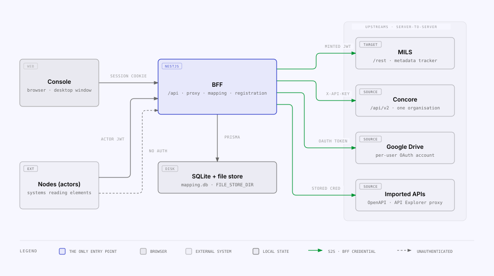

<!-- Generated from the MILS Bridge source repository (docs/overview/what-this-is.md). Edit it there, not here. -->

# What this is

**MILS Node** is the integration component between **MILS**, a metadata tracker,
and the systems whose data gets registered into it — Concore first, then Google
Drive files and any user-imported HTTP API. A NestJS backend-for-frontend owns
every upstream credential and the durable cross-reference between source ids and
MILS ids; a React console operates it; external systems ("nodes") read the
registered elements back through the same backend.

## Two problems, two answers

| Problem                                                                                                                                                                                                         | Answer                                                                                                                                                                                                                                                                                                               |
| --------------------------------------------------------------------------------------------------------------------------------------------------------------------------------------------------------------- | -------------------------------------------------------------------------------------------------------------------------------------------------------------------------------------------------------------------------------------------------------------------------------------------------------------------- |
| **Cross-origin.** A browser cannot call Concore, MILS or a third-party API directly — CORS, and the credentials would have to live in the browser.                                                              | **The BFF proxies server-to-server.** `apps/api` forwards `/api/mils/*` and `/api/concore/*` verbatim to the upstreams, injecting the credential itself (`apps/api/src/common/upstream-forwarder.ts`). The console holds no upstream secret and makes no cross-origin call.                                          |
| **Cross-reference.** Once a Concore entity (or a file, or an API exchange) is registered as a MILS Item, a later request carrying the MILS id must resolve back to the source entity — and the other way round. | **The mapping store.** `ResourceMapping` in SQLite (`apps/api/prisma/schema.prisma`) holds one row per source ↔ MILS pair, unique in both directions, with the registration trail and the payload MILS readers are served. See `registration-and-mapping.md`. |

Everything else in the repository — settings, access control, the actor
registry, statistics, the dashboard — exists to operate those two answers.

## Who talks to whom

| Party                    | Calls                                                                                         | Credential                                                                                                                                              |
| ------------------------ | --------------------------------------------------------------------------------------------- | ------------------------------------------------------------------------------------------------------------------------------------------------------- |
| Console (`apps/web`)     | Only the BFF, under `/api/*`                                                                  | Session cookie (console user)                                                                                                                           |
| Desktop (`apps/desktop`) | Runs the BFF and the console on one loopback origin                                           | Same as the console                                                                                                                                     |
| Nodes (MILS actors)      | The actor API (`/api/actor-registry/*`, guarded data reads) and the unauthenticated `/rest/*` | Actor JWT verified against the actor's certificate, or none                                                                                             |
| BFF → MILS               | `/rest`                                                                                       | RS256 JWT minted from the configured signing key, else `MILS_JWT`, else the forwarded header — see `mils.md` |
| BFF → Concore            | `/api/v2`, organisation-scoped list reads                                                     | API key + organisation from Settings, else env — see `concore.md`                                         |
| BFF → Google Drive       | Drive API as the connected console user                                                       | Per-user OAuth tokens stored in `GoogleAccount`                                                                                                         |
| BFF → imported APIs      | The API's base URL only, through a per-API proxy                                              | The credential stored on the `ApiIntegration`                                                                                                           |

The BFF also keeps its own state on disk: the SQLite database (mapping store,
settings, users, access rules, audit, metrics) and the local file store for
registered files (`FILE_STORE_DIR`).

## The three packages

| Package          | Path              | Role                                                                                                                                                  |
| ---------------- | ----------------- | ----------------------------------------------------------------------------------------------------------------------------------------------------- |
| `@bridge/api`    | `apps/api`        | NestJS BFF: proxies, mapping + registration, settings, access, actor registry, audit, metrics, dashboard, the locally implemented mils-internal API   |
| `@bridge/web`    | `apps/web`        | React 19 + Vite + TanStack console; talks only to the BFF                                                                                             |
| `@bridge/shared` | `packages/shared` | Zod schemas, enums and DTOs both sides validate against, plus the two runtime helpers that must not drift (`resolveAccess`, the integration registry) |

`@bridge/desktop` (`apps/desktop`) is the fourth workspace package: an Electron
shell that stages the other three into a Windows installer — see
`desktop.md`.

## What "register" means

Registering takes a source entity and, in order: looks up an existing mapping,
snapshots the entity, creates a MILS Item (`POST /Items`), persists the mapping
and a `RegistrationLog` row, and stores the payload that the mils-internal
`ItemData` endpoint later serves. Google Drive registration downloads the file
into the local store first; API Explorer registration checks the exchange
payload size first. The three flows and the mapping lifecycle are in
`registration-and-mapping.md`.

## What a node gets back

A node authenticates with its actor JWT and reads mappings, registrations and
item payloads under `/api/integration/*`; the deliberately unauthenticated
`/rest/*` surface serves the payload bytes and stored files the
MILS side expects. Which node may read which element is decided by the access
model in [`access-control.md`](access-control.md),
recorded per request in `dashboard-audit-statistics.md`.

## Related

- [`glossary.md`](glossary.md) — the vocabulary (including the three meanings of "node").
